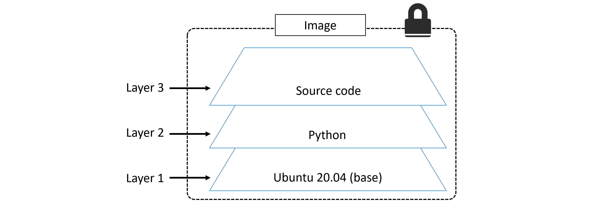
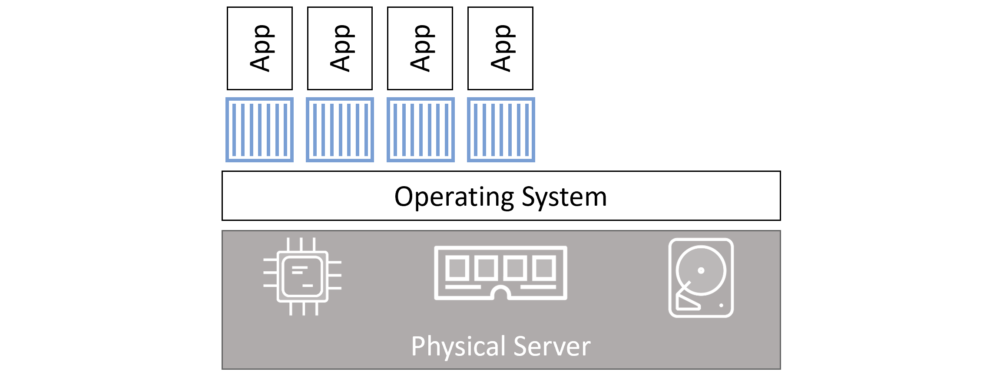
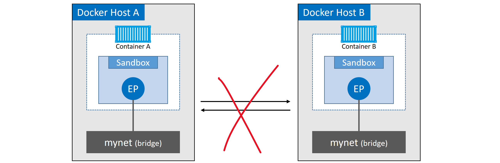
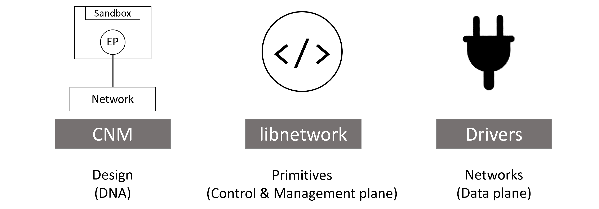

# Introduction to containers
- containers are an easy, fast, lightweight that enables us to bundle a certain app with its requirements which allows/benefits us to deploy multiple stuff in an efficient manner
- it's a way to make apps and put it inside a box with its dependenices and requirements, it can be portable, vm do this stuff too, why I don't use VM ?

## VMs
## How they work & issues
- issue aroused when 
  - I needed to deploy multiple applications with this architecture so i will need other VM so i will need other servers<br>
|  APP                      |<br>
|  Libraries | Dependencies |<br>
|    OS                     |<br>
|    HW                     |<br>

  - the specs of servers started to grow (core 16, 32, 64... ) & rams up to 1TB
  - so this kind of server you will use just to install **one (1) VM**, it's a waste of resources
  - the need to use different server ubuntu, debian, ...etc
  

-  virtualization existed from 60s
- so that's why virtualization concept appeared to manage this inefficiency, which virtualizes for example cpu, ram, storage 
- untill we reached that we can install one VM where we can divide the VM/physical machine into different virtual machines, better utilization of resources
  - no need to buy another physical machine
  - no need to allocate  
- dev||ops :: build and create the vm || adminstration (maintaining) of the vm start, stop, backup
- best thing to understand containers is to understand VMs
- VM tax one of its stuff is inefficient resource utilization, supporting liscences, maintaining each vm health and its configuration  

## How to solve the VM issue
  - maybe we can avoid maintaining each VM & its configurations; by creating a VM template but it will need someone who's aware of the technology itself and its details regarding dependencies 
- how to solve the vm issue
  - what if we can can get the app & dependecies out of this equation
  - also we're not interested in user mode (software level) in the OS
  - we're interested in the kernel of the OS, if we can use it. we've cut halfway where this kernel is shared across all my apps
  - container idea is that it depends on the kernel of the installed machine where i don't need to create OS for each app I will create
  - in this way i avoided
    - performing operations, maintaining and the security measures per each VM
    -  paying liscence for each OS running on different VM
    -    

## Virtual Machine (VM) vs containers
### VM
differencing disk <br>
virtual hard disk .vhd<br>
base disk<br>
base image<br>
- here you can find where we created a vm template for the web app
- we created a base disk (base image) where its own vhd file that has its own storage
- when we need to clone other vm, we don't need to restore the whole virtual disk all over again, just we will have the parent image plus the current differening disk


### Container
- os specifications add the user mode part where it adds commands, services or daemons 
- adds another requirements layer on the top of the os system
  - so it's like the container started with kernel adding up parts it need until we reach the app layer
  - so it's **like** a VM but without all the stuff in the OS we don't need
    - kernel image is the same for all linux, windows and you will just need to add the stuff you need in the user mode
    - **this is the container main idea**
    
- we can consider each layer has its own differencing disk and differencing file
- **Container is the sum of all the layers installed**
- we can merge all this layers but it's not recommended
- image consists of one or multiple layers which are read that you can copy and create a container from it.

- containers compared to images is like running vm compared to vm template.


### cgroups & namespaces
- it's an old concept since 70s, unix and linux systems depend on containers internally inside its kernel
- unix & linux depends on two things c-groups and namespaces
  - cgroups 
    - is a technology implement way to monitor a certain process & all of its children consumption in terms of cpu, ram, io ...etc. like htop showing process, task manager in windows. also the ability to assign each process to the needed resources
  - namespaces 
    - is to monitor the hierarchy of the processes  for exampe proc1-> proc2, proc3, proc3-> proc4, proc5. 
    - it ensures the the resources of these processes is accessible/shareable among all of the processes within the same namespace. 
    - it can also isolate the resources of a certain group from the other running processes
-  **if you think about cgroups & namespaces, it's like the container** 
-  linux can treat them as one unit and send them singals like stop, terminate ...etc. so it will terminate all of the process which stops the whole container
-  because of these two concepts exist in linux kernel so i only need linux kernel which exists in all linux distributions (fedora, ubuntu, centos)
  


# Introduction to docker

## Docker
- It's a company called Docker Inc (named previously dotcloud)
- It has a technology called Docker it's similar to HyperV in windows and VMWare
- It builds the containers, images, perform operations and maintain the containers
- The SW can be downloaded in win, linux and mac but it only runs on win and linux environments 
  - On windows HyperV checks if we need linux containers, it will run a linux VM on windows. the containers of linux will be put inside the linux VM that the Docker desktop created. the same concept applies to macOS
- Registry is a storage that contains the images
## Some comands
- on docker
  - docker container ls
  - docker container ls -a (display -a all containers even the stopped ones)
  - docker image ls
  - docker run -it -d -p hostport:dockerbindingport image_name:latest (install if not exist and run it )
  - docker image pull fedora:latest
  - docker container rm b52 5bf
  - docker image rm image_name
  - docker container create -it fedora (img_name or id)
- on linux
  - docker info
  - groups
  - getent group
  - sudo usermod -aG docker ahmed (created a group for docker with host machine account to take )
  
## Installing / Play with container 
### basic comands
- docker image pull fedora:latest<br>
    latest: Pulling from library/fedora<br>
    d4df0db66c89: Pull complete <br>
    Digest: sha256:5ce8497aeea599bf6b54ab3979133923d82aaa4f6ca5ced1812611b197c79eb0 (produces uniqe sha like git)<br>
    Status: Downloaded newer image for fedora:latest<br>
    docker.io/library/fedora:latest<br>
- ahmed@ahmed-3510:~$ docker image ls
- REPOSITORY                                                                               TAG       IMAGE ID  CREATED         SIZE
- fedora                                                                                   latest    5e22da79803c   5 weeks ago     222MB
- docker container create -it fedora bash 
  - 4019b420787b3baf4d56ec45d3935a65f978654f307cdd4b65edf2c6f032eaee
- docker container start -i 4019
- [root@4019b420787b /]# cat /etc/*hostname
  - 4019b420787b (same name as the container id)
- [root@4019b420787b /]# hostname
  - bash: hostname: command not found
  - which indicates that it lacks basic stuff. this means we only need the basic stuff to run other layers on top of it
- ahmed@ahmed-3510:~$ docker container ls<br>
CONTAINER ID   IMAGE     COMMAND                  CREATED         STATUS              PORTS                                           NAMES
4019b420787b   fedora    "bash"                   3 minutes ago   Up About a minute                                                   sharp_cartwright

- **docker run command reduces the need of 1) docker pull 2) docker create 3) docker start**


### `docker run`

The `docker run` command is used to create and start a new container from an image. It combines several actions into one:

1. **Create** a new container from a specified image.
2. **Start** the container.
3. Optionally, **run** a command within the container.

**Syntax:**
```sh
docker run [OPTIONS] IMAGE [COMMAND] [ARG...]
```

**Key Points:**
- **Create a New Container:** `docker run` always creates a new container. If you run the same command multiple times, it will create multiple containers.
- **Initial Setup:** It sets up the container environment, including port mappings, volume bindings, environment variables, and more.
- **Image:** You need to specify an image from which the container will be created.
- **Options:** There are many options you can use with `docker run` to customize the container's behavior (e.g., `-d` for detached mode, `-p` for port mapping, `-v` for volumes).

**Example:**
```sh
# Create and start a new container from the nginx image
docker run -d -p 8080:80 nginx
```
This command will create and start a new container from the `nginx` image, running it in detached mode (`-d`) and mapping port 8080 on the host to port 80 on the container.

### `docker exec`

The `docker exec` command is used to run a new command in an already running container. It allows you to execute additional processes inside the existing container.

**Syntax:**
```sh
docker exec [OPTIONS] CONTAINER COMMAND [ARG...]
```

**Key Points:**
- **Existing Container:** `docker exec` requires a container that is already running. It does not create a new container.
- **Execute Commands:** It runs a command inside the context of an existing container. This is useful for debugging or running additional processes.
- **Interactive Mode:** You can use `-it` options to run commands interactively, allowing you to attach to the container's terminal.

**Example:**
```sh
# Run a bash shell in an existing container
docker exec -it <container_id_or_name> /bin/bash
```
This command will open an interactive bash shell inside the specified running container.

### Differences

| Aspect            | `docker run`                              | `docker exec`                              |
|-------------------|-------------------------------------------|--------------------------------------------|
| Purpose           | Create and start a new container          | Run a command in an existing container     |
| Container State   | Creates a new container                   | Requires an already running container      |
| Usage             | Initial setup, starting containers        | Running additional commands/processes      |
| Container Creation| Always creates a new container instance   | Does not create a new container            |
| Typical Use Cases | Deploying applications, creating new services | Debugging, running maintenance commands, accessing container shell |

### Summary

- **`docker run`**: Used to create and start a new container from an image. Ideal for deploying applications or starting new services.
- **`docker exec`**: Used to run a new command inside an existing running container. Ideal for debugging, maintenance, and accessing the container's shell.

Understanding when to use `docker run` and `docker exec` helps in effectively managing Docker containers, whether you're deploying new services or maintaining existing ones.


## container vs VM

- **when you **exit** the container, the instance get terminated. which tell us that docker has only one goal which is that container should run only process, if the process is terminated then the whole container becomes useless**
- usually when you're inside a VM you can use the whole OS and its functions, also you can use the existing apps inside it
- **the container unlike vm is that when i bundle my app and its requirements only and it has that part of OS needed to run my app. in other words we can say the container = application**
- **each container must have a command that spins up that container, in other words we can say the container = command. if we closed the python bash terminal (app) we existed the bash so the whole app is terminated.**
  - so if we run python container and exited, it terminates the container. 
  - if we run python /bin/bash terminal, then run a python terminal and existed from, the terminal doesn't get terminated.
  -  **why, because this was the only running process in case of python (pid 1) the main process, in case of running bash terminal, the bash is the pid1**
- it's better to keep layers separated not merged, so that docker doesn't have to reinstall an existing layer but just keep another one on the top of it. 
  - ```root@b8f387d955c9:/# ps -e 
    PID TTY          TIME CMD
      1 pts/0    00:00:00 bash
    ```

# Overview of Docker Engine


The Docker engine consists of several key components working together to run and manage containers. These components are:

1. **Docker Client**
2. **Docker Daemon**
3. **Containerd**
4. **Runc**
5. **Plugins**

**it's a loosely (decoupled) couple architecture where each part is responsibile for certain actions so you can upgrade docker daemon whereas shim process is handling the running containers** 

Let's break down each part:

### 1. Docker Client
- **What it is**: The Docker client is a command-line interface (CLI) tool that allows users to interact with the Docker daemon.
- **Functionality**: It sends commands to the Docker daemon via REST APIs or grpc ??. These commands can include operations like building images, starting/stopping containers, and fetching container logs.
- **Example**: 
  ```bash
  docker run hello-world
  ```
  This command tells the Docker client to communicate with the Docker daemon to run a container using the `hello-world` image.

### 2. Docker Daemon (a.k.a engine) dockerd 
- **What it is**: The Docker daemon (dockerd) listens for Docker API requests and manages Docker objects such as images, containers, networks, and volumes.
- **Functionality**: It is responsible for creating, running, and monitoring containers. It communicates with other daemons to manage Docker services.
- **Example**: 
  - When you run `docker run -d nginx`, the Docker client sends this command to the Docker daemon, which pulls the `nginx` image (if not already available) and starts a container in detached mode.

### 3. Containerd
- **What it is**: Containerd is an industry-standard core container runtime that manages the complete container lifecycle, from image transfer and storage to container execution and supervision.
- **shim process** it inherits some stuff of the containerd and run whatever happened to the container (start, stop ..etc.) so it doesn't affect the running container
- **Functionality**: It handles the heavy lifting of running containers. Containerd pulls images from container registries, manages container storage, and supervises the container's lifecycle.
- **Example**: When the Docker daemon receives a command to run a container, it delegates the task to Containerd, which then uses `runc` to start the container.
- **Example** 

### 4. Runc
- **What it is**: Runc is a lightweight, portable container runtime that runs containers according to the Open Container Initiative (OCI) specifications.
- **Functionality**: It is responsible for setting up and running containers based on the specifications defined by Containerd.
- **Example**: Runc creates the container's namespaces, cgroups, and filesystem to ensure it runs in isolation from the host and other containers.

### 5. Plugins
- **What it is**: Plugins extend Docker's capabilities by adding additional functionalities such as networking and volume drivers.
- **Functionality**: They allow Docker to integrate with different storage backends, network topologies, and other infrastructure components.
- **Example**: 
  - **Volume plugin**: Allows containers to use storage solutions such as NFS or Amazon EFS.
  - **Network plugin**: Integrates Docker with custom networking solutions like Weave or Flannel.

### How Docker Components Interact
1. **User Command**: The user issues a command via the Docker client, for example, `docker run`.
2. **API Call**: The Docker client sends this command to the Docker daemon using Docker's REST API.
3. **Daemon Processing**: The Docker daemon processes the command and interacts with Containerd.
4. **Containerd Task**: Containerd handles the actual container lifecycle operations, delegating to Runc when necessary to start or stop containers.
5. **Plugin Usage**: If additional functionalities are needed (e.g., storage or network), the daemon interacts with the appropriate plugins.
6.  by default docker daemon listens on 2375 tcp port over http which isn't secured
7.  Locally over IPC sockets:
    - `/var/run/docker.sock` on Linux  
    - `//./pipe/docker_engine` on Windows
### Example Workflow
1. **Command**: `docker run -d --name mynginx nginx`
2. **Docker Client**: Sends the run command to the Docker daemon.
3. **Docker Daemon**: Checks if the `nginx` image is available locally; if not, it pulls the image from Docker Hub.
4. **Containerd**: Manages the lifecycle of the `mynginx` container.
5. **Runc**: Sets up the container environment and starts the `nginx` container.
6. **Plugins**: If the container requires specific network settings or storage volumes, the Docker daemon will interact with the relevant plugins.

This interaction allows Docker to provide a streamlined, efficient way to build, ship, and run applications in isolated environments called containers.


# Dockerd vs containerd vs RUNC - Bonus section
I understand that the roles of the Docker daemon, Containerd, and Runc can seem overlapping. Let's clarify their distinct functionalities and interactions in the Docker architecture.

### Docker Daemon (dockerd)
- **Role**: Manages the overall Docker system.
- **Responsibilities**:
  - Listens for Docker API requests from the Docker client.
  - Coordinates with Containerd to manage containers.
  - Manages Docker objects like images, containers, networks, and volumes.
  - Handles image builds and distribution.
- **Scope**: High-level orchestration and management of containers and images.
- **Interaction Point**: The Docker daemon is the entry point for all Docker commands. When a command is issued, the daemon processes it and delegates tasks to Containerd.

### Containerd
- **Role**: Manages container lifecycle and low-level container operations.
- **Responsibilities**:
  - Pulls images from container registries.
  - Manages container storage.
  - Supervises the container's entire lifecycle (creation, execution, deletion).
  - Interfaces with Runc for container execution.
- **Scope**: Mid-level management of container lifecycle and resources.
- **Interaction Point**: Containerd receives directives from the Docker daemon and executes them, managing the container operations and delegating execution to Runc.

### Runc
- **Role**: Executes containers according to the OCI (Open Container Initiative) specifications.
- **Responsibilities**:
  - Sets up the container environment (namespaces, cgroups, filesystem).
  - Executes the container's process.
  - Ensures container isolation.
- **Scope**: Low-level execution of containers.
- **Interaction Point**: Runc is invoked by Containerd to start and stop containers. It performs the actual container creation and management at the system level.

### Detailed Comparison and Interaction

1. **Command Issuance**:
   - **Docker Daemon**: Receives a high-level command from the Docker client, such as `docker run`.
   - **Containerd**: The Docker daemon forwards specific container-related tasks to Containerd.
   - **Runc**: Containerd calls Runc to perform the actual process execution.

2. **Image Handling**:
   - **Docker Daemon**: Manages image builds and distribution.
   - **Containerd**: Downloads images from a registry, stores them, and prepares them for container creation.
   - **Runc**: Not involved in image handling.

3. **Container Creation**:
   - **Docker Daemon**: Receives a request to create a container and forwards it to Containerd.
   - **Containerd**: Manages the setup process, ensuring all necessary resources are allocated, and then invokes Runc.
   - **Runc**: Sets up the container environment (namespaces, cgroups) and starts the container.

4. **Lifecycle Management**:
   - **Docker Daemon**: Provides high-level API endpoints for managing the container lifecycle (start, stop, pause, remove).
   - **Containerd**: Handles the detailed management of the container's state, such as maintaining container metadata and handling restarts.
   - **Runc**: Executes low-level commands to run and stop containers.

### Example Workflow: Running a Container

1. **User Command**: 
   ```bash
   docker run -d nginx
   ```
2. **Docker Client**: Sends this command to the Docker daemon.
3. **Docker Daemon**: 
   - Parses the command.
   - Checks if the `nginx` image is available.
   - If not available, instructs Containerd to pull the image from Docker Hub.
4. **Containerd**:
   - Pulls the `nginx` image.
   - Stores the image and prepares it for container creation.
   - Allocates necessary resources (e.g., filesystem, network) for the container.
   - Instructs Runc to start the container.
5. **Runc**:
   - Sets up the container environment (namespaces, cgroups, filesystem).
   - Executes the `nginx` container process.
6. **Containerd**: 
   - Monitors the container's state and manages its lifecycle events.
7. **Docker Daemon**:
   - Provides status updates and logs to the Docker client.
   - Handles additional high-level management commands (e.g., stop, restart).

**In summary, the Docker daemon orchestrates the overall process and communicates with the Docker client. Containerd manages the detailed lifecycle of containers, including pulling images and preparing the environment. Runc executes the containers based on the specifications provided by Containerd, ensuring they run in isolated environments. Each component has a distinct and complementary role, ensuring efficient and modular container management.**


# Docker Images

- image is the packaged/bundled application which contains all the layers above the kernel level (which docker hosts run on it), layers may be app libraries, dependicies ...etc.
- commands create while building the build file (the creation time of the image) is called build time commands , while commands created while the creating the container is called runtime commands (like bash, exec python)

## image 
## image naming
- by default the pull command downloads the image from a registry which is hub.docker.com, a cloud storage that contains the images and its layers
- image_name = <repoistory>:<tag> example python:3.10
  - 
- there're two ways of pulling official vs non-official images
    - docker image pull python:3.10 # official image
    - docker image pull ahmedsam/flask_docker # non official image

## image archecitcture 
### Images & Layers
1. image consists of read only layers after being shipped, every layer is separate and has its own id 
   1. 
   2. 
2. download, create, extract, you can notice that each layer has its own id, where the image is download it generates a new sha which is the image id
   1. 
3. An example
   1. 
4. docker separate images into layers where there can be a modification produced in certain layer at a certain file will create a new layer then it will be merged together at the end layer 1 and layer 2
   1. 
   2. 
   3. 


### Multi-architecture images
- when i pull an image `docker pull python`, how does docker know the os i will use ? linux or windows for example
- there's something called **manifest**
- - Windows and Linux, on variations of ARM, ARM 64, IBM Z, IBM POWER, x64, PowerPC, and s390x.
- A single image tag supporting multiple platforms and architectures.
- To make this happen, the Registry API supports two important constructs:
    - **`manifest lists`**
    - **`manifest files`**
- that's why pulling separate layers for os and then the application make things easier to build on top of the base image
- 


### Image commands
- `docker container run -it --name "python_app" python:3.9 bash/bindoc` 
- `docker image inspect ahmedsam/flask_docker:latest`
- `docker container inspect mongodb_creds`
- `docker image ls -q` -- show all images' ids
- `docker rm $(docker image ls -q)`
  


# Containers

- A container is the runtime instance of an image
- instead of running a full blown OS like a VM, the containers share the OS/kernel they run on
- single docker image can run multiple docker containers
- Example
  - `docker container --name fedora_test create -it fedora bash`  && `docker container start -i fedora_test`
  - `docker container run --name "python_app" -it python:3.9`
  - `docker container stop|start|rm container_name`
`docker exec` and `docker run` are two Docker commands used for different purposes when working with containers. Here's a detailed explanation of each command, including their differences and typical use cases.

## VM vs container
1.  
   1. as you can see the vm, the physical server exists and the top of it the HyperVisor
   2. each VM has its own OS and apps
   3. **it performs hardware virtualization by virtualizing the cpu, ram, storage per each vm**

2. 
   1. in the container, the container which contains the app run on the same OS hosted by the docker container
   2. **it performs OS virtualization by carving OS resources into the virtual versions called containers**


### Stopping containers gracefully
- `docker container stop` sends a **SIGTERM** signal **to PID(1)**
- If the process doesn't exit in 10 sec it sends a **SIGKILL** signal  
- note: ```SIGTERM is a signal used to request a process to terminate gracefully, which can be sent by other processes or the system itself. SIGKILL is a signal used to forcefully terminate a process without allowing it to perform any cleanup operations```

### Self-healing containers with restart policies
Restart policies are applied per-container, and can be configured imperatively on the command line as part of `docker container run` commands, or declaratively in YAML files for use with higher-level tools

**`always`**  
container will always restart if the main process is killed from inside the container but won't restart if you manually stopped it. Will restart if the Docker daemon restarts.  
**`unless-stopped`**  
container will always restart if the main process is killed from inside the container but won't restart if you manually stopped it. However WILL NOT restart if the Docker daemon restarts.  
**`on-failue`**  
container will always restart if the main process exits with non-zero code (i.e. with error) but won't restart if you manually stopped it. However will restart if the Docker daemon restarts.  


`docker container run --name <container-name> --restart always <image-name> <process>`
1. `$ docker container run --name neversaydie -it --restart always alpine sh`
2. `# exit`
3. `$ docker container ls`
4. `$ docker container inspect neversaydie`


### Webserver example
1. `$ docker container run -d --name webserver -p 8090:80 nginx:latest` (must use port 80 as nginx by default listens on port 80 & 443 so since my machine has a running apache (kafka) i must change the host machine port)
   1. inside "NetworkSettings"
```
   "Ports": {
                "80/tcp": [
                    {
                        "HostIp": "0.0.0.0",
                        "HostPort": "8001"
                    },
                    {
                        "HostIp": "::",
                        "HostPort": "8001"
                    }
                ]
            },
```

2. open browser http://localhost:8090
3. stop the container 
4. open browser again and refresh
5. start the container
6. open browser again and refresh


# Network


## How to deal with volume/storage
### Example: copying a file
- ahmed@ahmed-3510:~/development/docker_big_data$ docker container cp ./hello.py /tmp/hello.py
  - must specify at least one container source
  - specify sp (source path) dp (destination path)
- ahmed@ahmed-3510:~/development/docker_big_data$ docker container cp ./hello.py python_latest:/tmp/hello.py
  - Successfully copied 2.05kB to python_latest:/tmp/hello.py
- the issue with this approach that I must copy the file each time I modify it to be reflected inside the docker container
- 
```
>>> import os
>>> os.listdir()
['usr', 'bin', 'mnt', 'run', 'home', 'sys', 'sbin', 'lib', 'root', 'tmp', 'var', 'srv', 'proc', 'etc', 'opt', 'dev', 'boot', 'media', 'lib64', '.dockerenv']
>>> os.listdir()
['usr', 'bin', 'mnt', 'run', 'home', 'sys', 'sbin', 'lib', 'root', 'tmp', 'var', 'srv', 'proc', 'etc', 'opt', 'dev', 'boot', 'media', 'lib64', '.dockerenv']
>>> os.listdir('/tmp')
['copiedfile.py'] // after copying the file using docker container cp
>>> exec(open('tmp/copiedfile.py').read())
hello from hello.py
```


## trying to connect to another container && Service discovery


1. check this example where we ran two containers web using nginx and client using centOS and we will try to connect them together through port
2. notice that the containers on the same host can connect using the ipaddress but not their name
   1. `docker container run -d --name web nginx:latest`
   2. ahmed@ahmed-3510:~$ `docker container run -it --name client centos:latest`<br>
   [root@88e5bb7f5234 /]# curl http://web<br>
   curl: (6) Could not resolve host: web<br>
   3. [root@88e5bb7f5234 /]# ping 172.17.0.2<br> 
   PING 172.17.0.2 (172.17.0.2) 56(84) bytes of data.<br>
   64 bytes from 172.17.0.2: icmp_seq=1 ttl=64 time=0.227 ms<br>
3. how we can resolve 2.2. issue ? there's a temporary workaround where we can use by --add-host source:IP_ADDR by resolving the ipadress to name
    ahmed@ahmed-3510:~$ docker container run -it --name client --add-host web:172.17.0.2  centos:latest <br>
    [root@30431c288f9e /]# ping web <br>
    PING web (172.17.0.2) 56(84) bytes of data.<br>
    64 bytes from web (172.17.0.2): icmp_seq=1 ttl=64 time=0.072 ms<br>
    [root@30431c288f9e /]# curl http://web <br>
    ... <br>
    Welcome to nginx!<br>
    ....<br>
4. how this happened ? as we added an entry in the hosts file through the previous --add-host flag included in the command
    ```
    [root@31318e6b92bc /]# cat /etc/hosts
    127.0.0.1	localhost
    ::1	localhost ip6-localhost ip6-loopback
    fe00::0	ip6-localnet
    ff00::0	ip6-mcastprefix
    ff02::1	ip6-allnodes
    ff02::2	ip6-allrouters
    172.17.0.3	web
    172.17.0.4	31318e6b92bc

    ```


### Service discovery
- Service discovery allows all containers and Swarm services to locate each other by **name**.
- Example
  - 

## Networks

### ip addr show
`ahmed@ahmed-3510:~/development/docker_big_data$ ip addr show`
1. default loopback address
   1. lo: <LOOPBACK,UP,LOWER_UP> mtu 65536 qdisc noqueue state UNKNOWN group default qlen 1000
    link/loopback 00:00:00:00:00:00 brd 00:00:00:00:00:00
    inet 127.0.0.1/8 scope host lo
       valid_lft forever preferred_lft forever
    inet6 ::1/128 scope host 
       valid_lft forever preferred_lft forever
2. my address on the host machine
   1. eno1: <NO-CARRIER,BROADCAST,MULTICAST,UP> mtu 1500 qdisc fq_codel state DOWN group default qlen 1000
    link/ether 34:73:5a:df:7c:b5 brd ff:ff:ff:ff:ff:ff
    altname enp2s0
3. docker network, any docker container takes this default ip address`172.17`
   1. docker0: <BROADCAST,MULTICAST,UP,LOWER_UP> mtu 1500 qdisc noqueue state UP group default 
    link/ether 02:42:2d:27:da:08 brd ff:ff:ff:ff:ff:ff
    inet 172.17.0.1/16 brd 172.17.255.255 scope global docker0
       valid_lft forever preferred_lft forever
    inet6 fe80::42:2dff:fe27:da08/64 scope link 
       valid_lft forever preferred_lft forever


### Types
1. bridge (default network)
2. none
3. host
------------------------
- docker network ls<br>
  NETWORK ID     NAME      DRIVER    SCOPE<br>
  839672519d5a   bridge    bridge    local<br>
  b1302561812f   host      host      local<br>
  37a9640acfa8   none      null      local<br>

**As you can find here by default there're two networks which are loopback interface & ethernet interface that are connected to the bridge docker network using `172.17`**

* **we created two docker containers which are alp1 and alp2, in our host machine let's check the networks added, you can find that the new added network start with veth and have the docker0 network**
    ```
    ahmed@ahmed-3510:~/development/docker_big_data$ ip link show
    166: veth8395e96@if165: <BROADCAST,MULTICAST,UP,LOWER_UP> mtu 1500 qdisc noqueue master docker0 state UP mode DEFAULT group default 
    link/ether 6a:bd:f3:df:fe:ac brd ff:ff:ff:ff:ff:ff link-netnsid 1
    168: veth4e8e5f7@if167: <BROADCAST,MULTICAST,UP,LOWER_UP> mtu 1500 qdisc noqueue master docker0 state UP mode DEFAULT group default 
        link/ether c2:a8:85:f9:39:00 brd ff:ff:ff:ff:ff:ff link-netnsid 0
    ```

1. **Bridge Network example**
  * In the default bridge network you can find two networks as show which are Loopback & Ethernet
    ```
    ahmed@ahmed-3510:~/development/docker_big_data$ `docker container run -it --name alp2 alpine`
    / # hostname
    52ca40044e7b
    / # ifconfig
    eth0      Link encap:Ethernet  HWaddr 02:42:AC:11:00:02  
              inet addr:172.17.0.2  Bcast:172.17.255.255  Mask:255.255.0.0
              UP BROADCAST RUNNING MULTICAST  MTU:1500  Metric:1
              RX packets:29 errors:0 dropped:0 overruns:0 frame:0
              TX packets:0 errors:0 dropped:0 overruns:0 carrier:0
              collisions:0 txqueuelen:0 
              RX bytes:4278 (4.1 KiB)  TX bytes:0 (0.0 B)

    lo        Link encap:Local Loopback  
              inet addr:127.0.0.1  Mask:255.0.0.0
              UP LOOPBACK RUNNING  MTU:65536  Metric:1
              RX packets:0 errors:0 dropped:0 overruns:0 frame:0
              TX packets:0 errors:0 dropped:0 overruns:0 carrier:0
              collisions:0 txqueuelen:1000 
              RX bytes:0 (0.0 B)  TX bytes:0 (0.0 B)
    ```

2. **None Network example**
  * let's create another container that's connected to the `None` network, as you can see it's only connected to the loopback network only
    ```
    ahmed@ahmed-3510:~/development/docker_big_data$ docker container run -it --name alp3 --network none alpine
    / # hostname
    27216d47318a
    / # ifconfig
    lo        Link encap:Local Loopback  
              inet addr:127.0.0.1  Mask:255.0.0.0
              UP LOOPBACK RUNNING  MTU:65536  Metric:1
              RX packets:0 errors:0 dropped:0 overruns:0 frame:0
              TX packets:0 errors:0 dropped:0 overruns:0 carrier:0
              collisions:0 txqueuelen:1000 
              RX bytes:0 (0.0 B)  TX bytes:0 (0.0 B)
    ```
3. **Host Network example** which is a special case that expose the host machine network and the containers acts as if it's the host
  * let's create another container that's connected to the `None` network, as you can see it's only connected to the loopback network only
    ```
    / # hostname
      ahmed-3510
    / # ifconfig
      br-126c6c14ae03 Link encap:Ethernet  HWaddr 02:42:2A:11:DF:BA  
                UP BROADCAST MULTICAST  MTU:1500  Metric:1
                RX packets:0 errors:0 dropped:0 overruns:0 frame:0
                TX packets:0 errors:0 dropped:0 overruns:0 carrier:0
                collisions:0 txqueuelen:0 
                RX bytes:0 (0.0 B)  TX bytes:0 (0.0 B)

      br-3ff36bb5f851 Link encap:Ethernet  HWaddr 02:42:59:B8:8C:2B  
                inet addr:10.0.0.1  Bcast:10.0.255.255  Mask:255.255.0.0
                UP BROADCAST MULTICAST  MTU:1500  Metric:1
                RX packets:0 errors:0 dropped:0 overruns:0 frame:0
                TX packets:0 errors:0 dropped:0 overruns:0 carrier:0
                collisions:0 txqueuelen:0 
                RX bytes:0 (0.0 B)  TX bytes:0 (0.0 B)

      br-7984b0085b7f Link encap:Ethernet  HWaddr 02:42:EA:EB:CE:3A  
                inet addr:172.22.0.1  Bcast:172.22.255.255  Mask:255.255.0.0
                UP BROADCAST MULTICAST  MTU:1500  Metric:1
                RX packets:0 errors:0 dropped:0 overruns:0 frame:0
                TX packets:0 errors:0 dropped:0 overruns:0 carrier:0
                collisions:0 txqueuelen:0 
                RX bytes:0 (0.0 B)  TX bytes:0 (0.0 B)

      docker0   Link encap:Ethernet  HWaddr 02:42:2D:27:DA:08  
                inet addr:172.17.0.1  Bcast:172.17.255.255  Mask:255.255.0.0
                inet6 addr: fe80::42:2dff:fe27:da08/64 Scope:Link
                UP BROADCAST RUNNING MULTICAST  MTU:1500  Metric:1
                RX packets:49329 errors:0 dropped:0 overruns:0 frame:0
                TX packets:86930 errors:0 dropped:0 overruns:0 carrier:0
                collisions:0 txqueuelen:0 
                RX bytes:12613381 (12.0 MiB)  TX bytes:12478065 (11.8 MiB)

      eno1      Link encap:Ethernet  HWaddr 34:73:5A:DF:7C:B5  
                UP BROADCAST MULTICAST  MTU:1500  Metric:1
                RX packets:0 errors:0 dropped:0 overruns:0 frame:0
                TX packets:0 errors:0 dropped:0 overruns:0 carrier:0
                collisions:0 txqueuelen:1000 
                RX bytes:0 (0.0 B)  TX bytes:0 (0.0 B)

      lo        Link encap:Local Loopback  
                inet addr:127.0.0.1  Mask:255.0.0.0
                inet6 addr: ::1/128 Scope:Host
                UP LOOPBACK RUNNING  MTU:65536  Metric:1
                RX packets:997065 errors:0 dropped:0 overruns:0 frame:0
                TX packets:997065 errors:0 dropped:0 overruns:0 carrier:0
                collisions:0 txqueuelen:1000 
                RX bytes:466842514 (445.2 MiB)  TX bytes:466842514 (445.2 MiB)

      veth4e8e5f7 Link encap:Ethernet  HWaddr C2:A8:85:F9:39:00  
                inet6 addr: fe80::c0a8:85ff:fef9:3900/64 Scope:Link
                UP BROADCAST RUNNING MULTICAST  MTU:1500  Metric:1
                RX packets:0 errors:0 dropped:0 overruns:0 frame:0
                TX packets:65 errors:0 dropped:0 overruns:0 carrier:0
                collisions:0 txqueuelen:0 
                RX bytes:0 (0.0 B)  TX bytes:11160 (10.8 KiB)

      veth8395e96 Link encap:Ethernet  HWaddr 6A:BD:F3:DF:FE:AC  
                inet6 addr: fe80::68bd:f3ff:fedf:feac/64 Scope:Link
                UP BROADCAST RUNNING MULTICAST  MTU:1500  Metric:1
                RX packets:0 errors:0 dropped:0 overruns:0 frame:0
                TX packets:85 errors:0 dropped:0 overruns:0 carrier:0
                collisions:0 txqueuelen:0 
                RX bytes:0 (0.0 B)  TX bytes:13856 (13.5 KiB)

      wlp0s20f3 Link encap:Ethernet  HWaddr F8:5E:A0:8C:C2:92  
                inet addr:192.x.x.x  Bcast:192.x.x.x  Mask:255.255.255.0
                inet6 addr: fe80::a431:85fb:fa43:2bb2/64 Scope:Link
                UP BROADCAST RUNNING MULTICAST  MTU:1500  Metric:1
                RX packets:18820431 errors:0 dropped:0 overruns:0 frame:0
                TX packets:6095188 errors:0 dropped:0 overruns:0 carrier:0
                collisions:0 txqueuelen:1000 
                RX bytes:20811404113 (19.3 GiB)  TX bytes:2051387199 (1.9 GiB)


    ```
  * it's a special case which rarely we don't use
  * We can use it rarely in a case where we use the networks on the host machine without **port forwarding** like we did with nginx client and nginx web where the dns resolver located the ip addr so we can use `curl http://web`
  * You can't allocate special port in host network mode
    * `docker container run -d --name web --network host -p 8090:80 nginx`
    ```
      WARNING: Published ports are discarded when using host network mode
      02c61d10e54636ba201cb2ed02dd6b782d0d7f11a3bee4396e8ee0e04ad35d69
    ```


### Create|Connect|Disconnect a network
- `docker network create mynet`<br>
  - NETWORK ID     NAME      DRIVER    SCOPE<br>
    7984b0085b7f   mynet     bridge    local<br>
- `docker network connect containername` such as `docker network connect mynet alp1`  
- `docker network create --subnet 10.0.0.0/16 mynet2` in this case we specified our subnet unlike `172.17`
  - now this container is connected to more than one network (bridge & mynet)
  - `docker network connect mynet2 alp2`
  - As you can see after connecting the `alp2` container to `mynet2` network, eth2 network which contains the subnet `10.0` is now connected to the `alp2` container
  - Everytime connecting to a network, it will connect to it as if we create a new virtual adaptor/switch
    - `docker exec -it alp2`
      ```
      / # ifconfig
        eth0      Link encap:Ethernet  HWaddr 02:42:AC:11:00:02  
                  inet addr:172.17.0.2  Bcast:172.17.255.255  Mask:255.255.0.0
                  UP BROADCAST RUNNING MULTICAST  MTU:1500  Metric:1
                  RX packets:105 errors:0 dropped:0 overruns:0 frame:0
                  TX packets:0 errors:0 dropped:0 overruns:0 carrier:0
                  collisions:0 txqueuelen:0 
                  RX bytes:16552 (16.1 KiB)  TX bytes:0 (0.0 B)

        eth2      Link encap:Ethernet  HWaddr 02:42:0A:00:00:02  
                  inet addr:10.0.0.2  Bcast:10.0.255.255  Mask:255.255.0.0
                  UP BROADCAST RUNNING MULTICAST  MTU:1500  Metric:1
                  RX packets:60 errors:0 dropped:0 overruns:0 frame:0
                  TX packets:0 errors:0 dropped:0 overruns:0 carrier:0
                  collisions:0 txqueuelen:0 
                  RX bytes:9484 (9.2 KiB)  TX bytes:0 (0.0 B)

        lo        Link encap:Local Loopback  
                  inet addr:127.0.0.1  Mask:255.0.0.0
                  UP LOOPBACK RUNNING  MTU:65536  Metric:1
                  RX packets:0 errors:0 dropped:0 overruns:0 frame:0
                  TX packets:0 errors:0 dropped:0 overruns:0 carrier:0
                  collisions:0 txqueuelen:1000 
                  RX bytes:0 (0.0 B)  TX bytes:0 (0.0 B)
      ``` 
  - `docker network disconnect mynet2 alp2` `docker network disconnect bridge alp2`
    - it's connected to none network now
  - internal switch where containers connect to the bridge network can see each other but can't be exposed to the outerworld, you can use it in case of testing
    - `docker network create --internal mynet3`
    - `docker network connect mynet3 alp1`
      - 
      ```            
          "mynet3": {
                "IPAMConfig": {},
                "Links": null,
                "Aliases": [
                    "95622fbb1c66"
                ],
                "MacAddress": "02:42:ac:17:00:02",
                "NetworkID": "126c6c14ae037744323b5602f40b1c38cbdb4d7f6668e3ddc6c2030040dde7ba",
                "EndpointID": "02196595fc621f1d21401180e2b3cb34a3972b3e77352e176ffdd0042fe27b26",
                "Gateway": "",
                "IPAddress": "172.23.0.2",
              ...
          }
      ```
    - `ping 172.23.0.2<br>
PING 172.23.0.2 (172.23.0.2): 56 data bytes`
    - `docker network connect mynet3 alp2`

## Drivers
### Types of docker drivers
- **Bridge**
- **Mcvlan**
- **Overlay**

### Driver details
Docker drivers are essential components that enable Docker to interact with different storage systems and network configurations. There are two main types of Docker drivers: storage drivers and network drivers.

1. **Bridge**
   - **Description**: The default network driver. It creates a private internal network on the host so containers can communicate with each other.
   - **Use Case**: Suitable for standalone containers that need to communicate with each other and with the host.
   - **Example**: Use the bridge network for simple, multi-container applications running on a single Docker host.

2. **Host**
   - **Description**: Removes network isolation between the container and the Docker host. The container uses the host's network stack directly.
   - **Use Case**: Useful when network performance is crucial, and you do not need isolation.
   - **Example**: Use the host network for applications requiring low-latency network access, such as monitoring tools.

3. **Overlay**
   - **Description**: Enables communication between Docker containers across multiple Docker hosts. It uses an overlay network to connect containers.
   - **Use Case**: Ideal for multi-host Docker Swarm or Kubernetes setups.
   - **Example**: Use the overlay network for microservices architectures spread across multiple Docker hosts.

4. **Macvlan**
   - **Description**: Assigns a MAC address to each container, making it appear as a physical device on the network.
   - **Use Case**: Suitable for legacy applications that expect direct network access or need a unique MAC address.
   - **Example**: Use the Macvlan network to integrate containers with a physical network where containers need to have their own IPs and MAC addresses.

5. **None**
   - **Description**: Disables all networking for a container.
   - **Use Case**: Use for containers that do not need any network access.
   - **Example**: Use the none network for data processing or batch jobs that do not require network communication.

6. **Plugins**
   - **Description**: Allows the use of third-party network drivers that provide custom network functionality.
   - **Use Case**: Useful when built-in drivers do not meet specific network requirements.
   - **Example**: Use a third-party plugin for specialized networking setups, such as SDN (Software-Defined Networking) solutions.

### Choosing the Right Driver

- **Storage Drivers**: Choose based on your kernel version, filesystem needs (snapshotting, compression), and performance requirements.
- **Network Drivers**: Choose based on your application's network architecture (single-host, multi-host, external connectivity) and performance requirements.


### Single-host bridge networks
- **Single-host**: only exists on a single Docker host and can only connect containers that are on the same host.
- **Bridge**: implementation of an 802.1d bridge (layer 2 switch).
- Linux: created by `bridge` driver.
- Windows: created by `nat` driver.
- All new containers will be connected to the default network unless `--network` flag is used.
- **in the bridge network all the containers inside the host can communicate with each other, but won't be able to communicate with other hosts**
  - Example: 
- The default “bridge” network, on all Linux-based Docker hosts, maps to an underlying _Linux bridge_ in the kernel called **“docker0”**  
  - `$ ip link show`
  - 

- Linux drivers: `bridge`, `overlay`, and `macvlan`.  
- Windows drivers: `nat`, `overlay`, `transparent`, and `l2bridge`.
- 3rd parties can also write _remote drivers_ or plugins.
- The driver is responsible for creating, managing and deletings network resources.

## Theory
Docker networking components:
- The Container Network Model (CNM)
- libnetwork
- Drivers
  - **CNM is the standard, libnetwork is the implementation of that standard**
  - 


## The Container Network Model (CNM)

CNM Building Blocks:
- **Sandboxes**: an isolated network stack. It includes; Ethernet interfaces, ports, routing tables, and DNS config.
- **Endpoints**: virtual network interfaces responsible for making sandboxes connect to networks.
- **Networks**: software implementation of an switch (802.1d bridge)


### Example

if we have this python app
``` python
import redis


app = Flask(__name__)
cache = redis.Redis(host='192.x.x.x', port=6379)
try:
    # Test the Redis connection
    print("PRE PING")
    print(f"result = {cache.ping()}")
    print("cache host", cache)

except redis.ConnectionError as ex:
    print("Failed to connect to Redis.", ex)


if __name__ == "__main__":
    app.run(host="0.0.0.0", debug=True)
```
**and have build this python app into a docker container, we won't be able to connect to redis since we're trying to connect to redis using the localhost which is on the host network not the docker network so docker won't be able to identify it**

#### how can we solve it
1. **Run the docker container using host network** `docker container run -it --network host pyapp` this will allow the docker to have access on the host machine network hence it will connect to redis without issues
2. **Use the host IP address** using `hostname -I | awk '{print $1}'` so you can access the network outside the docker container since both networks are on the same machine


# Storage/Volume

```
root@ahmed-3510:/var/lib/docker# ls
buildkit  containers  engine-id  image  network  overlay2  plugins  runtimes  swarm  tmp  volumes
```
- storage default drivers is `overlay2` different from the network driver `overlay`
- let's check the centos for example storagd driver, you can find that inside the `diff` there's a layout similar to the centos directory
- this is the layer which is copied read/write layer when you create the container 
  ```
  root@ahmed-3510:/var/lib/docker/overlay2# cd b82b5c613654149b8a54efcdf4b9b671f8b3aecba32746b68ad6ec1cf7342f3c
  root@ahmed-3510:/var/lib/docker/overlay2/b82b5c613654149b8a54efcdf4b9b671f8b3aecba32746b68ad6ec1cf7342f3c# ls
  committed  diff  link
  root@ahmed-3510:/var/lib/docker/overlay2/b82b5c613654149b8a54efcdf4b9b671f8b3aecba32746b68ad6ec1cf7342f3c# cd diff
  root@ahmed-3510:/var/lib/docker/overlay2/b82b5c613654149b8a54efcdf4b9b671f8b3aecba32746b68ad6ec1cf7342f3c/diff# ls
  bin  dev  etc  home  lib  lib64  lost+found  media  mnt  opt  proc  root  run  sbin  srv  sys  tmp  usr  var  
  ```
- after running new container, you can find new directories in our host are created in the overlay2 directory
  ```
  root@ahmed-3510:/var/lib/docker/overlay2# ls | grep 5172c9946
  5172c994621367bee14910caf0255fe98d1e74c4ad2dbf78b85f54c9e2080fb5
  5172c994621367bee14910caf0255fe98d1e74c4ad2dbf78b85f54c9e2080fb5-init
  root@ahmed-3510:/var/lib/docker/overlay2# ls 5172c994621367bee14910caf0255fe98d1e74c4ad2dbf78b85f54c9e2080fb5/diff/
  root@ahmed-3510:/var/lib/docker/overlay2# 
  ```
## Non-persistent data
-  let's check how docker persist storage
  - inside the centos running container, write
    ```
    [root@b5412a54ee08 tmp]# echo "this a file inside centoscontainer" > text.txt
    [root@b5412a54ee08 tmp]# ls
    ks-script-4luisyla  ks-script-o23i7rc2	ks-script-x6ei4wuu  text.txt
    ```
  - the read/write layer, the change will be reflected in the same place in the `overlay2` storage 
    ```
    root@ahmed-3510:/var/lib/docker/overlay2/5172c994621367bee14910caf0255fe98d1e74c4ad2dbf78b85f54c9e2080fb5# ls diff/tmp/
    text.txt
    ```
  -  we won't find the container storage, if we remove the container and then check the related container storage or file
    ```
    root@ahmed-3510:/var/lib/docker/overlay2# cd 5172c994621367bee14910caf0255fe98d1e74c4ad2dbf78b85f54c9e2080fb5
    bash: cd: 5172c994621367bee14910caf0255fe98d1e74c4ad2dbf78b85f54c9e2080fb5: No such file or directory
    ```
  - so we can say that the lifetime of the storage of a container is the same as the container lifetime

How we can resolve this issue ->
**Bind mount**

## persistent data

1. there's a simple way you can achive that 
    ```
    docker container run -it -v /home/ahmed/development/docker_big_data/code:/app/code python bash
    Type "help", "copyright", "credits" or "license" for more information.
    >>> import os
    >>> os.listdir('/app/code')
    ['hello.py']
    >>> exec(open('/app/code/hello.py').read())
    hello from hello.py
    ```
  - I changed the content of the `hello.py` and without restarting the container, i get this
    ```
    >>> exec(open('/app/code/hello.py').read())
    hello from hello.py
    after binding mount
    ```

2. there's another way using **docker volume**
   - As you can see here when we mounted the host volume to the docker volume, it copied the content of the source directory to the destination directory inside docker container
   - `docker volume create myvol`
   ```
   root@ahmed-3510:/var/lib/docker/volumes# ls | grep "myvol"
   myvol
   ```
  - then add the file you want in the created volume, as you can see it's created in my vol
    ```
    root@ahmed-3510:/var/lib/docker/volumes# cd myvol/_data/ && echo "print('Hello from docker volume myvol')" > hello.py
    root@ahmed-3510:/var/lib/docker/volumes/myvol/_data# ls
    hello.py
    ```
  - also it's created inside the python docker container using `docker container run -it -v myvol:/app/code python bash`
    ```
    root@2175b2786bff:~# ls /app/code/
    hello.py
    root@2175b2786bff:~# python /app/code/hello.py 
    Hello from docker volume myvol
    ```
  - configurations using `docker volume inspect myvol`
    ```
    ahmed@ahmed-3510:~/development/docker_big_data$ docker volume inspect myvol 
    [
        {
            "CreatedAt": "2024-06-18T18:56:46+03:00",
            "Driver": "local",
            "Labels": null,
            "Mountpoint": "/var/lib/docker/volumes/myvol/_data",
            "Name": "myvol",
            "Options": null,
            "Scope": "local"
        }
    ]
    ``` 
   - this is more configurable, flexible and allow us to move volumes without worrying about their place


## In summary

- **Containers are designed to be immutable**
- many applications require a read-write filesystem in order to simply run – they won’t even run on a read-only filesystem.
- **Every Docker container is created by adding a thin read-write layer on top of the read-only image it’s based on**
  - 
- **The writeable layer is called many names: _local storage_, _ephemeral storage_, and _graphdriver storage_.**
- It’s typically located on the Docker host in these locations:
    - Linux Docker hosts: `/var/lib/docker/<storage-driver>/...`
    - Windows Docker hosts: `C:\ProgramData\Docker\windowsfilter\...`
- it gets created when the container is created and it gets deleted when the container is deleted
- Managed on Docker host using a storage driver (Ubuntu: `overlay2` or `aufs`. `overlay2` is recommended)


### Containers and persistent data
- _Volumes_ are the recommended way to persist data in containers.
    - **Volumes are independent objects that are not tied to the lifecycle of a container**
    - **Volumes can be mapped to specialized external storage systems**
    - **Volumes enable multiple containers on different Docker hosts to access and share the same data**


### Third-party volume drivers are available as plugins (Cloud, SAN, NAS, etc.)
we can make for example our volume to be stored on s3 bucket


### Sharing storage across cluster nodes


# Containerizing an application
## Flask Example
- let's write this python flask code into python container
  - 
  ``` python
  from flask import Flask
  app = Flask(__name__)

  @app.route('/')
  def hello_world():
      return 'Hello, World!'
  
  if __name__ = '__main__':
    app.run(debug=False, port=5000, host='0.0.0.0')

  ```
  - we updated and upgrade the `apt` package then we installed `vim` using `apt install vim`
  - then `pip install flask` and run `python hello.py`
- note that we commit the changes we made similar to github, we're also using deployable image name where my username on docker hub registry and a tag name v1.0. it generated a sha signature
  ```
  ahmed@ahmed-3510:~/development/docker_big_data$ docker commit pyflask ahmedsam/pyflask_dock_course:v1.0
  sha256:9c260e524b9faa68db5f91670901d37bdebf2c711d75c6dd5f2b4b19432df487

  ```
- removed the pyflask running container & run the  `docker container run -d -p 5000:5000 --name pyf ahmedsam/pyflask_dock_course:v1.0 python /app/hello.py`generating `2907e794425f79835d83cf97e555d27e13e019329fc008872d10be0793369084` 
- if we visited `http://localhost:5000/` we will find the container running and returning a valid response


**Is that the efficient way in case we need to modify the code?**
* As each time we will need to change code, we will create another container 
* change the code since it's hardcoded, exit the container and commit the changes
* also if we need to add new libraries we will install it each time

**We can do that using Dockerfile** To automate this process

## Dockerfile
- the docker file contents for our flask app
  ```
  # FROM baseImage:tag
  # WORKDIR /path/to/workdir
  # COPY [flags] source ... dest
  # RUN command parameter ...
  # EXPOSE PORT
  # CMD [ "executable" ] or CMD commands
  ```
- in the same Dockerfile directory, write `docker build -t ahmedsam/pyflask_dock_course:v1.1 .`
  - `-t` tag name
  - `.` the destination directory to build from
- **you can find what happens**, each time change happens it makes a temporary container/intermediate. it create layer per each instruction
  ```
  [+] Building 6.9s (10/10) FINISHED                                                                                          docker:default
  => [internal] load build definition from Dockerfile                                                                                  
  => => transferring dockerfile: 1.34kB                                                                                                
  => [internal] load metadata for docker.io/library/python:latest                                                                      
  => [internal] load .dockerignore                                                                                                     
  => => transferring context: 2B                                                                                                       
  => [1/5] FROM docker.io/library/python:latest                                                                                        
  => [internal] load build context                                                                                                     
  => => transferring context: 279B                                                                                                     
  => [2/5] WORKDIR /app                                                                                                                
  => [3/5] COPY requirements.txt .                                                                                                     
  => [4/5] RUN pip install -r requirements.txt                                                                                         
  => [5/5] COPY hello.py .                                                                                                              
  => exporting to image                                                                                                             
  => => exporting layers                                                                                                            
  => => writing image sha256:94274a56460b1a87c9f3eb066ca9820e22a6a17ef05b8546bfabf53eb3056150                                          
  => => naming to docker.io/ahmedsam/pyflask_dock_course:v1.1      
  ```
- some commands which called at the runtime such as `EXPOSE` & `CMD` are used to modify in the image metadata as it can create new
- note that when building an image all the layers from the base image like `from python:latest` exist at the beginning of the layers list `inspect` then the layers we created are appended

- also from the following part you can make sure to download the same image even if it's updated with the same tag by fixing the sha by writing `FROM python@sha256:3966b81808d864099f802080d897cef36c01550472ab3955fdd716d1c665acd6`
  ```
  "RepoTags": [
      "python:latest"
  ],
  "RepoDigests": [
      "python@sha256:3966b81808d864099f802080d897cef36c01550472ab3955fdd716d1c665acd6"
  ],

  ```
### Metadata/Runtime instructions

- **the EXPOSE and CMD instructions are not part of the layer creation process but are metadata and runtime instructions. Hence, they do not create additional layers and are not displayed as part of the build step output.**

- **EXPOSE and CMD are instructions that do not create layers but define the behavior and configuration of the container at runtime.**
- **The EXPOSE instruction informs Docker that the container will listen on the specified network ports at runtime.**
-  **This information is stored as metadata in the image and does not affect the filesystem, so it does not create a new layer and therefore does not appear in the build output.**
- **The CMD instruction sets the default command to be run when the container starts. Like EXPOSE, it does not modify the filesystem and thus does not appear in the build steps as a layer creation.**

#### Summary
**When you build the image, Docker only shows the steps that create new layers. EXPOSE and CMD are instructions for container runtime configuration and do not modify the image's filesystem, hence they do not appear in the build output as new layers. The image is built correctly and is functioning as expected if it runs without issues.**

### How it works


### Commands - deep dive

- To avoid copying certain files you can create `.dockerignore` file similar to `.gitignore`
- `FROM baseimage` **FROM must be the first instruction in a Dockerfile.**
  - Set the baseImage to use for subsequent instructions. 
  - it inherits all the baseimage metadata
  - `FROM SCRATCH` used to build minimum image
- if we used to subsequent `WORKDIR` instruction it will consider the second path as a subsequent path of the first working directory path, it will consider the `subdir` directory's path as `/app/subdir` 
  ```
  WORKDIR /app
  WORKDIR subdir
  ```
  - always add `/` in directory path to avoid confusion betwen directory & file
- `COPY` instruction used to copy file from the build context different examples
  - `COPY hello.py  /app/hello.py` -- shell mode which means the hello.py file in the current directory to the /app directory
  - `COPY hello.py startup.sh /app/` -- shell mode
  - `COPY *.py app/` -- shell mode which means copy all python files in the current directory to the /app directory
  - `COPY .  /app/` -- shell mode which means copy all files in the current directory to the /app directory
  - `COPY ["name with spaces.py", "/app"]` -- exec mode
- `ADD` command unlike `copy` add files that don't exist at the build context like downloading file from internet or copying file from github or copying file from a tar file
- `SHELL` command note that by default docker assume that you execute using this command from the standard shell `/bin/sh ` 
  - sometimes you need to execute commands from bash shell not standard shell
  - `SHELL ["/bin/bash", "-c"]`
  - you can make python itself execute through its interactive shell as the default shell of this dockerfile `SHELL ["/user/local/bin/python", "-c"]`
  - The Dockerfile Instructions RUN instructions in a Dockerfile are executed in a shell.
  - By default, Docker uses /bin/sh -c to execute the commands in a RUN instruction.
  - If the base image doesn't include /bin/sh, the RUN command will fail because it can't find the shell to execute the command.

- `RUN` 
  - get excuted in the std shell
  - it doesn't take any inputs
  - `RUN ["command", "arg1", "arg2"]` the recommended run executive command
    - since you may download image that doesn't has standard shell `/bin/sh` or bash `/bin/bash`
  - `RUN echo "this is another file" > /tmp/file` 
  - useful to add debugging output lines too like logging in JS
- `METADATA` commands 
  - `LABEL is_dev="true"` useful for inspection which doesn't the runtime
  - `ENV PATH $PATH:/app` global environment metadata variable command to set variables
    - why we don't use `RUN EXPORT PATH=/app`? **as the run command will be bound to the active running shell, once we exit from it, the var will be erased so it's more reliable and configurable to set it using `ENV`** 
  - Examples
    - `ENV <name> <value>` single variable
    - `ENV var1=val1 var2=val2` multiple variables
    - `ENV PATH="/usr/local/hadoop/bin:${PATH}` brace mode where i can add certain path to the current path variable
- `USER` if we note that all containers we use depend on the root user to run, there're some OS systems that don't have the authentication system for adding user, groups ...etc.
  - `RUN groupadd hadoop && useradd -g hadoop hduser`
  - `USER hduser` so it's like i added a `su` to the 
  - `RUN id` it displays the users and their groups such as
    ```
    ahmed@ahmed-3510:~/development/docker_big_data/app$ id
    uid=1000(ahmed) gid=1000(ahmed) groups=1000(ahmed),4(adm),24(cdrom),27(sudo),30(dip),46(plugdev),122(lpadmin),135(lxd),136(sambashare),999(docker)
    ```
- `ARG` to use certain variable multiple time in the **Dockerfile** not the image itself to avoid repeating/copy&paste
  - `ARG <arg>=<value>`
  - `ARG PYTHON_IMAGE_TAG=3.12.0`
- we can override cmd & entrypoint by providing arguments while running the container for example,
  - `docker run -it python bash` using bash here overrides the default commands and allow us into the python repl mode
  - it get executed at the runtime while creating container
- **it's redundant to add commands if they're already exist in the official image, so it's nice to be aware of what the official image provide before adding redundant command**
### `CMD` and `ENTRYPOINT` in Dockerfile


* Both `CMD` and `ENTRYPOINT` instructions in a Dockerfile define what commands get executed within a container. However, they have distinct purposes and use cases.
* Entrypoint is the original command while cmd is the arguments that get executed after the entrypoint
#### 1. `CMD`
The `CMD` instruction provides defaults for an executing container. It is used to set the default command and parameters that will be executed when a container runs. 

**Key Points about `CMD`:**
- There can be only one `CMD` instruction in a Dockerfile. If you include multiple `CMD` instructions, only the last one will be executed.
- It can be overridden by specifying a command at the end of `docker run --cmd`.

**Examples:**
```dockerfile
# Example 1: CMD with an array
FROM ubuntu:latest
CMD ["echo", "Hello, World!"]

# Example 2: CMD with a shell form
FROM ubuntu:latest
CMD echo "Hello, World!"
```
In the above examples, when the container runs, it will execute the `echo "Hello, World!"` command.

#### 2. `ENTRYPOINT`
The `ENTRYPOINT` instruction configures a container that will run as an executable. Unlike `CMD`, it cannot be overridden at runtime with a command line argument. Instead, any additional arguments provided during `docker run` will be passed as arguments to the `ENTRYPOINT`.

**Key Points about `ENTRYPOINT`:**
- It sets the main command to be executed.
- You can define an `ENTRYPOINT` in combination with `CMD` to provide default arguments that can be overridden.

**Examples:**
```dockerfile
# Example 1: ENTRYPOINT with an array
FROM ubuntu:latest
ENTRYPOINT ["echo"]

# Example 2: ENTRYPOINT with CMD
FROM ubuntu:latest
ENTRYPOINT ["echo"]
CMD ["Hello, World!"]
```
In the first example, running the container will execute `echo` with any additional arguments passed during `docker run`. In the second example, if no additional arguments are passed, it defaults to `echo "Hello, World!"`.

### 3. Comparison and Differences
**Comparison Table:**

| Aspect             | `CMD`                                   | `ENTRYPOINT`                                |
|--------------------|-----------------------------------------|---------------------------------------------|
| Purpose            | Set default command and arguments       | Set the container's main command            |
| Overridable        | Yes, with command line arguments        | No, but additional arguments are appended   |
| Use with Arguments | Can provide default arguments           | Can combine with `CMD` to provide defaults  |
| Syntax             | Shell form or exec form                 | Exec form preferred                         |
| Flexibility        | More flexible (overridden easily)       | More rigid (sets the main entry point)      |

**Use Cases:**
- **`CMD`**: Use when you need to provide a default command with optional arguments that users can override. Example: running a script with default options.
- **`ENTRYPOINT`**: Use when you want to set a fixed command for the container to run, and you might want to pass additional arguments. Example: setting up a container to always run a specific application.

**Practical Example:**
```dockerfile
# Using CMD
FROM ubuntu:latest
CMD ["sleep", "10"]

# Using ENTRYPOINT with CMD
FROM ubuntu:latest
ENTRYPOINT ["sleep"]
CMD ["10"]
```
- In the first case, the container will run `sleep 10` by default, but you can override it with `docker run <image> sleep 5`.
- In the second case, `sleep` is set as the main command, and `10` is the default argument. Running `docker run <image> 5` will execute `sleep 5`.

### Summary
- `CMD` is used to provide default commands and arguments.
- `ENTRYPOINT` is used to define a fixed command for the container.
- They can be combined to set a default command with overridable arguments.

Understanding the distinction between `CMD` and `ENTRYPOINT` helps in crafting Dockerfiles that are flexible yet precise in defining container behavior.


### Example using flask

#### When i tried to connect a flask app using bash shell instead
it wasn't working since the **path** was `/bin/bash` and as we said earlier command=container so thats why it wasn't running the flask app
```Dockerfile
ENTRYPOINT ["/bin/bash", "-c"]
CMD [ "python", "hello.py" ]

```
``` json
    "Path": "/bin/bash",
    "Args": [
        "-c",
        "python",
        "hello.py"
    ],
```

#### So i changed the syntax to be more suitable to run in the shell
`CMD ["echo 'Running some setup...' && python hello.py"]`
``` json
        "Cmd": [
            "echo 'Running some setup...' && python hello.py"
        ],
        "ArgsEscaped": true,
        "Image": "",
        "Volumes": null,
        "WorkingDir": "/app",
        "Entrypoint": [
            "/bin/bash",
            "-c"
        ],
```

#### the basic and working syntax is
`CMD [ "python", "hello.py" ] # works without entrypoint command`

### -c flag
In the context of running `/bin/bash`, the `-c` flag is used to tell the shell to read and execute commands from the following string or script. It allows you to run commands directly from the command line or from a script without needing to enter an interactive shell session.

For example, if you run:

```bash
/bin/bash -c "echo Hello, World!"
```

The `-c` flag tells Bash to execute the `echo Hello, World!` command. This can be useful in situations where you want to run a single command or a short script without launching a full interactive shell session.

**that's why the app worked when we used a shell command**

# Image registeries 


- there's a local registry on the host machine
- you can use cloud registeries such as google-gcr, amazon ecr (elastic container registry), docker.hub, azure registeries

## how to push image
- docker login
  - enter your username and password
- inside the Dockerile directory `docker tag srcImgName dstImgName`
  - `docker tag ahmedsam/pyflask_dock_course:v1.6 ahmedsam/pyflaskapp:v1.6`
  - note if you don't specify the tag, it will tag all the created tags
- To upload image into the docker registry of my account `docker image push ahmedsam/pyflaskapp:v1.6` 
  - 
  - 
    ```
    the push refers to repository [docker.io/ahmedsam/pyflaskapp]
    6e6e7e3a8a96: Pushed 
    61873735e85f: Pushed 
    63ffa6eeff2f: Pushed 
    d025e13776ce: Pushed 
    490770c36be4: Mounted from library/python 
    d2533dcba450: Mounted from library/python 
    ae9947778648: Mounted from library/python 
    cbe4fb5e267b: Mounted from library/python 
    734c0f0b65c2: Mounted from library/python 
    8845ab872c1c: Mounted from library/python 
    d7d4c2f9d26b: Mounted from library/python 
    bbe1a212f7e9: Mounted from library/python 
    v1.6: digest: sha256:cd11e354e926d0b5ecc9788385d215450732a08f67ec79232b0c2feacbf8ba59 size: 2838  
    ```
- **if you make a change, then try to push the image, only the layer changed will get pushed not all whole layers from the start**


# Docker Compose

- docker compose is a python package to automate the application building and its services. first created by fig orchard then docker inc bought that company
- a key value pair configuration file
- Each Application consists of several components/services 
- **Service** is  **container (code) + network + storage**

## Ways to install docker-compose

* By **apt-get**
  * `sudo apt-get install docker-compose`
* By **curl**
  * `sudo curl -L "https://github.com/docker/compose/releases/latest/download/docker-compose-$(uname -s)-$(uname -m)" -o /usr/local/bin/docker-compose`
  * `sudo mv /usr/local/bin/docker-compose /usr/bin/docker-compose`
  * `sudo chmod +x /usr/local/bin/docker-compose`
  * `docker-compose -V`
* By **pip**
  * `pip install docker-compose`

## docker-compose.yml

to try the docker-compose file, we will install simple python app using redis to count number of visits to a web app

`git clone git@github.com:nigelpoulton/counter-app.git`
## main keys are
- version
- services
- network
- volume


## Example using Flask & Redis 
``` yaml
version: "3.5"
services:
  web-fe:
    build: .
    command: python app.py
    ports:
      - target: 5000
        published: 5000
    networks:
      - counter-net
    volumes:
      - type: volume
        source: counter-vol
        target: /code
  redis:
    image: "redis:alpine"
    networks:
      counter-net:

networks:
  counter-net:

volumes:
  counter-vol:
```


Sure, here's a summary of the provided `docker-compose.yml` file:

### Docker Compose File Summary

- **Version:** Uses Docker Compose version 3.5.

- **Services:**
  1. **web-fe:**
     - **Build:** Builds the image using the Dockerfile in the current directory (`.`).
     - **Command:** Runs the `python app.py` command.
     - **Ports:** Maps port 5000 of the container to port 5000 on the host.
     - **Networks:** Connects to the `counter-net` network.
     - **Volumes:** Mounts the Docker-managed volume `counter-vol` to `/code` inside the container.
  2. **redis:**
     - **Image:** Uses the `redis:alpine` image from Docker Hub.
     - **Networks:** Connects to the `counter-net` network.

- **Networks:**
  - **counter-net:** Defines a network named `counter-net` that is used by both the `web-fe` and `redis` services for communication.

- **Volumes:**
  - **counter-vol:** Defines a Docker-managed volume named `counter-vol` used by the `web-fe` service for persisting data at the `/code` directory inside the container.

### docker-compose up

output
```
^C(venv) ahmed@ahmed-3510:~/development/docker_big_data/counter-app$ docker-compose up &
[1] 3670624
(venv) ahmed@ahmed-3510:~/development/docker_big_data/counter-app$ WARN[0000] /home/ahmed/development/docker_big_data/counter-app/docker-compose.yml: `version` is obsolete 
[+] Running 9/9
 ✔ redis Pulled                                                                                                        8.2s 
   ✔ d25f557d7f31 Already exists                                                                                       0.0s 
   ✔ b03b02e01fda Pull complete                                                                                        1.0s 
   ✔ 7b8eb84c4535 Pull complete                                                                                        1.1s 
   ✔ ad34468061c3 Pull complete                                                                                        1.3s 
   ✔ d3f4ad8ba58b Pull complete                                                                                        5.1s 
   ✔ 6f3e0605beb6 Pull complete                                                                                        5.1s 
   ✔ 4f4fb700ef54 Pull complete                                                                                        5.2s 
   ✔ b44457c91edf Pull complete                                                                                        5.2s 
[+] Building 10.7s (10/10) FINISHED                                                                          docker:default
 => [web-fe internal] load build definition from Dockerfile                                                            0.1s
 => => transferring dockerfile: 159B                                                                                   0.0s
 => [web-fe internal] load metadata for docker.io/library/python:3.6-alpine                                            1.3s
 => [web-fe auth] library/python:pull token for registry-1.docker.io                                                   0.0s
 => [web-fe internal] load .dockerignore                                                                               0.0s
 => => transferring context: 2B                                                                                        0.0s
 => [web-fe internal] load build context                                                                               0.4s
 => => transferring context: 22.01MB                                                                                   0.3s
 => CACHED [web-fe 1/4] FROM docker.io/library/python:3.6-alpine@sha256:579978dec4602646fe1262f02b96371779bfb0294e92c  0.0s
 => [web-fe 2/4] ADD . /code                                                                                           0.4s
 => [web-fe 3/4] WORKDIR /code                                                                                         0.1s
 => [web-fe 4/4] RUN pip install -r requirements.txt                                                                   7.9s
 => [web-fe] exporting to image                                                                                        0.4s
 => => exporting layers                                                                                                0.4s
 => => writing image sha256:a57a3eead340c984568435279df73512a1022e542fdd768b7b92b750cad3a3f8                           0.0s
 => => naming to docker.io/library/counter-app-web-fe                                                                  0.0s
[+] Running 4/4
 ✔ Network counter-app_counter-net   Created                                                                           0.1s 
 ✔ Volume "counter-app_counter-vol"  Created                                                                           0.0s 
 ✔ Container counter-app-redis-1     Created                                                                           0.1s 
 ✔ Container counter-app-web-fe-1    Created                                                                           0.3s 
Attaching to redis-1, web-fe-1
redis-1   | 1:C 20 Jun 2024 18:38:56.349 # WARNING Memory overcommit must be enabled! Without it, a background save or replication may fail under low memory condition. Being disabled, it can also cause failures without low memory condition, see https://github.com/jemalloc/jemalloc/issues/1328. To fix this issue add 'vm.overcommit_memory = 1' to /etc/sysctl.conf and then reboot or run the command 'sysctl vm.overcommit_memory=1' for this to take effect.
redis-1   | 1:C 20 Jun 2024 18:38:56.349 * oO0OoO0OoO0Oo Redis is starting oO0OoO0OoO0Oo
redis-1   | 1:C 20 Jun 2024 18:38:56.349 * Redis version=7.2.5, bits=64, commit=00000000, modified=0, pid=1, just started
redis-1   | 1:C 20 Jun 2024 18:38:56.349 # Warning: no config file specified, using the default config. In order to specify a config file use redis-server /path/to/redis.conf
redis-1   | 1:M 20 Jun 2024 18:38:56.350 * monotonic clock: POSIX clock_gettime
redis-1   | 1:M 20 Jun 2024 18:38:56.351 * Running mode=standalone, port=6379.
redis-1   | 1:M 20 Jun 2024 18:38:56.352 * Server initialized
redis-1   | 1:M 20 Jun 2024 18:38:56.352 * Ready to accept connections tcp
web-fe-1  | PRE PING
web-fe-1  | result = True
web-fe-1  | cache host Redis<ConnectionPool<Connection<host=redis,port=6379,db=0>>>
web-fe-1  |  * Serving Flask app 'app' (lazy loading)
web-fe-1  |  * Environment: production
web-fe-1  |    WARNING: This is a development server. Do not use it in a production deployment.
web-fe-1  |    Use a production WSGI server instead.
web-fe-1  |  * Debug mode: on
web-fe-1  |  * Running on all addresses.
web-fe-1  |    WARNING: This is a development server. Do not use it in a production deployment.
web-fe-1  |  * Running on http://172.31.0.2:5000/ (Press CTRL+C to quit)
web-fe-1  |  * Restarting with stat
web-fe-1  |  * Debugger is active!
web-fe-1  |  * Debugger PIN: 324-421-592
web-fe-1  | 172.31.0.1 - - [20/Jun/2024 18:39:10] "GET / HTTP/1.1" 200 -
web-fe-1  | 172.31.0.1 - - [20/Jun/2024 18:39:11] "GET /favicon.ico HTTP/1.1" 404 -
web-fe-1  | 172.31.0.1 - - [20/Jun/2024 18:39:12] "GET / HTTP/1.1" 200 -
web-fe-1  | 172.31.0.1 - - [20/Jun/2024 18:39:12] "GET / HTTP/1.1" 200 -
```

**if we want to check the running containers**
```
CONTAINER ID   IMAGE                COMMAND                  CREATED              STATUS              PORTS                                       NAMES
0c965cf0d13f   counter-app-web-fe   "python app.py"          About a minute ago   Up About a minute   0.0.0.0:5000->5000/tcp, :::5000->5000/tcp   counter-app-web-fe-1
f4a0dc1bde28   redis:alpine         "docker-entrypoint.s…"   About a minute ago   Up About a minute   6379/tcp                                    counter-app-redis-1
```
- **notice that naming prefix always has `counter-app` which comes from the directory name where the `docker-compose` file lies**
- naming following `${directory_name}_${key_name}`
- there's a docker network created called `counter-app_counter-net`
- there's a docker volume created called `counter-app_counter-vol`
- **note that we must use `redis` the service name in the host configuration**, how ?
  - **as services can communicate with each other using the service name because of dns resolver**
  - Example: `cache = redis.Redis(host='redis', port=6379)` 
  -  result
    ```
    Executing task: docker exec -it 0c965cf0d13f1618325fd4101e96cdcf4dedd3285256af43b3e2d4d241af945e sh 
    /code # ping redis
    ```
  - `docker exec container_id|container_name ping -c 1 google.com`
  - result:
  ```
    PING google.com (142.250.200.206): 56 data bytes
    64 bytes from 142.250.200.206: seq=0 ttl=115 time=42.879 ms

    --- google.com ping statistics ---
    1 packets transmitted, 1 packets received, 0% packet loss
    round-trip min/avg/max = 42.879/42.879/42.879 ms

  ```
  - to test the container if it's running properly  
    - `docker-compose exec redis ping -c 1 web-fe`
    - `docker-compose exec web-fe ping -c 1 google.com`
    - `docker-compose ps` 
      ```
      WARN[0000] /home/ahmed/development/docker_big_data/counter-app/docker-compose.yml: `version` is obsolete 
      NAME                   IMAGE                COMMAND                  SERVICE   CREATED          STATUS          PORTS
      counter-app-redis-1    redis:alpine         "docker-entrypoint.s…"   redis     17 minutes ago   Up 17 minutes   6379/tcp
      counter-app-web-fe-1   counter-app-web-fe   "python app.py"          web-fe    17 minutes ago   Up 17 minutes   0.0.0.0:5000->5000/tcp, :::5000->5000/tcp
      ```
 - for more secure network to prevent it to interact with outside world we can add `internal: true` inside the `counter_net` it would make 
   - this command will succeed `docker-compose exec redis ping -c 1 web-fe` 
   - this command will fail `docker-compose exec redis ping -c 1 google.com`

## Volumes in Docker Compose

Volumes are a way to persist data generated or used by Docker containers. Unlike bind mounts, volumes are completely managed by Docker. They are stored in a part of the host filesystem that is managed by Docker (`/var/lib/docker/volumes/` on Linux), and can be backed up, restored, or moved more easily than bind mounts.

Let's explain each part:

#### `type: volume`

- **Type:** Specifies the type of mount. In this case, it is `volume`, which means Docker will manage the volume's lifecycle.
  
#### `source: counter-vol`

- **Source:** This is the name of the volume. If this volume does not exist, Docker will create it. The name `counter-vol` can be used to identify and reference this volume in your Docker Compose file.

#### `target: /code`

- **Target:** This is the path inside the container where the volume will be mounted. In this case, the volume `counter-vol` will be mounted to `/code` inside the `web-fe` container.

### How it Works

1. **Volume Creation:** When you run `docker-compose up`, Docker checks if the volume named `counter-vol` exists. If it doesn't, Docker will create it.
  
2. **Mounting the Volume:** Docker then mounts the volume `counter-vol` to the `/code` directory inside the `web-fe` container. This means any data written to `/code` inside the container will be stored in the volume `counter-vol`.
  
3. **Data Persistence:** The data stored in `counter-vol` persists even if the container is stopped or removed. The volume is only removed if explicitly deleted using a command like `docker volume rm counter-vol`.

4. **Sharing Data:** If you have multiple services in your `docker-compose.yml` file that also reference the `counter-vol` volume, they can share data through this volume. For example, another service could have:

   ```yaml
   services:
     another-service:
       ...
       volumes:
         - type: volume
           source: counter-vol
           target: /data
   ```

   In this case, `another-service` would have access to the same data stored in `counter-vol` but mounted at the `/data` path inside its container.

### Benefits of Using Volumes

- **Data Persistence:** Volumes ensure data persists across container restarts and removals.
- **Data Sharing:** Volumes allow data to be shared between multiple containers.
- **Data Management:** Volumes are managed by Docker, making them easier to backup, restore, and move compared to bind mounts.

### Conclusion

In summary, the `volumes` configuration in your `docker-compose.yml` file is setting up a Docker-managed volume named `counter-vol` and mounting it to the `/code` directory inside the `web-fe` container. This setup allows data written to `/code` in the container to persist and be shared with other containers if needed.


# Docker machine

### **It lets you create Docker hosts on your computer, on cloud providers, and inside your own data center. It creates servers, installs Docker on them, then configures the Docker client to talk to them.**
### **it's deprecated now since `Sep 26, 2021`**

## Install Docker Machine

- 
  ```
  curl -L https://github.com/docker/machine/releases/download/v0.16.2/docker-machine-`uname -s`-`uname -m` >/tmp/docker-machine &&
      chmod +x /tmp/docker-machine &&
      sudo cp /tmp/docker-machine /usr/local/bin/docker-machine`
  ```
- `sudo apt update`
- `sudo apt install virtualbox`
- `nano ~/.bashrc`
- `export PATH="/usr/lib/virtualbox:$PATH"`
- `source ~/.bashrc`
- `VBoxManage --version`
- 
  ``` 
  sudo docker-machine create --driver virtualbox manager1
  sudo docker-machine create --driver virtualbox worker1
  sudo docker-machine create --driver virtualbox worker2
  ```
### **i got this issue when i ran `sudo docker-machine create --driver virtualbox manager1`**
```
Error creating machine: Error in driver during machine creation: Error setting up host only network on machine start: /usr/bin/VBoxManage hostonlyif ipconfig vboxnet1 --ip 192.x.x.x --netmask 255.255.255.0 failed:
VBoxManage: error: Code E_ACCESSDENIED (0x80070005) - Access denied (extended info not available)
VBoxManage: error: Context: "EnableStaticIPConfig(Bstr(pszIp).raw(), Bstr(pszNetmask).raw())" at line 242 of file VBoxManageHostonly.cpp

```
### Solved it
i  ([solved it by following these instructions](https://stackoverflow.com/questions/70281938/docker-machine-unable-to-create-a-machine-on-macos-vboxmanage-returning-e-acces))
- find all the machines with docker-machine ls
- remove the ones you don't need with docker-machine rm -y <machineName>
- find all the "host-only ethernet adapters" with VBoxManage list hostonlyifs
- Remove the orphaned ones with VBoxManage hostonlyif remove <networkName>
- Create a vbox folder in the etc directory with `sudo mkdir /etc/vbox/networks.conf`
- Create a file networks.conf in the vbox folder, for example by sudo touch, place the below line there
  - 0.0.0.0/0 ::/0
- **P.S. One major drawback of the above solution is that every time you start the docker machine with docker-machine start <machineName> It takes a lot of time on Waiting for an IP...**
- `sudo usermod -aG vboxusers $(whoami)`
- `sudo usermod -aG vboxusers ahmed`
- then run `docker-machine create --driver virtualbox manager3`
  ```
    Running pre-create checks...
    Creating machine...
    (manager3) Copying /home/ahmed/.docker/machine/cache/boot2docker.iso to /home/ahmed/.docker/machine/machines/manager3/boot2docker.iso...
    (manager3) Creating VirtualBox VM...
    (manager3) Creating SSH key...
    (manager3) Starting the VM...
    (manager3) Check network to re-create if needed...
    (manager3) Waiting for an IP...
    Waiting for machine to be running, this may take a few minutes...
    Detecting operating system of created instance...
    Waiting for SSH to be available...
    Detecting the provisioner...
    Provisioning with boot2docker...
    Copying certs to the local machine directory...
    Copying certs to the remote machine...
    Setting Docker configuration on the remote daemon...
    Checking connection to Docker...
    Docker is up and running!
    To see how to connect your Docker Client to the Docker Engine running on this virtual machine, run: docker-machine env manager3

  ```
  - if you want to activate the created node on your host machine similar to ssh
    - `docker-machine env manager3`
      ```
      export DOCKER_TLS_VERIFY="1"
      export DOCKER_HOST="tcp://192.x.x.x:2376"
      export DOCKER_CERT_PATH="/home/ahmed/.docker/machine/machines/manager3"
      export DOCKER_MACHINE_NAME="manager3"
      # Run this command to configure your shell: 
      # eval $(docker-machine env manager3)
      ```
    - `eval $(docker-machine env manager3)`
  - check status `docker-machine ls`
    ```
    NAME       ACTIVE   DRIVER       STATE     URL                         SWARM   DOCKER      ERRORS
    manager3   *        virtualbox   Running   tcp://192.x.x.x:2376           v19.03.12   
    ```

- log into the machine `docker-machine ssh manager1`
  ```
    ( '>')
    /) TC (\   Core is distributed with ABSOLUTELY NO WARRANTY.
  (/-_--_-\)           www.tinycorelinux.net
  ```
  
  - `docker@manager1:~$ docker run -d -p 80:80 nginx` will install nginx on the manager1 vm
  - `docker@manager1:~$ logout`
  - to switch between different machine without the need to ssh every time `docker-machine env manager1` then execute the 
    - example where we previously created the nginx command
      ```
      ahmed@ahmed-3510:~/development/docker_big_data$ eval $(docker-machine env manager1)
      ahmed@ahmed-3510:~/development/docker_big_data$ docker ps
      CONTAINER ID   IMAGE     COMMAND                  CREATED         STATUS         PORTS                NAMES
      00cd4c6afaf4   nginx     "/docker-entrypoint.…"   2 minutes ago   Up 2 minutes   0.0.0.0:80->80/tcp   romantic_diffie

      ```
  - ` docker-machine stop manager1`
    ```
    Stopping "manager1"...
    Machine "manager1" was stopped.
    ``` 
  - `docker-machine create --driver virtualbox --help | less` helps you to assign certain specs to your vm 
 

# Docker Swarm

## ([hands on playlist on the docker swarm part](https://www.youtube.com/watch?v=z-Pck8o10bE&list=PL34sAs7_26wO2pVeB-2xdI76Tp8t704UN&index=7))

## The problem we face
- As we can see things are getting bigger, one application may have different services with different images
- at production level we have have lots of containers
- it would be complex to handle such load using single docker host
- how can we handle loading the services into multiple hosts yet treating them as one single unit to orechestrate different networks as if they were one network
- The most used solution is **Kubernetes** but docker itself offers a solution called **docker Swarm**

## Definition
**Docker Swarm is a native clustering and orchestration tool for Docker. It allows you to manage a cluster of Docker nodes (machines) as a single virtual system, making it easier to deploy, manage, and scale applications. Here's an overview of Docker Swarm**
- **Every node in the docker swarm either is a manager or worker**
- **Manager node is the controller where you can create, remove**
- **There's in memory database value store  `/etcd` in the manager nodes where it contains all the configurations of the swarm, service ..etc.**
- **Manager nodes can have any count but it's recommended to**
  - **have count between [1,7]**
  - **odd count**
- **Manager node can do some work similar to the worker, so in this case it acts as a manager & worker**
- **Worker nodes** can have count of any size

## Initializing a Swarm 

- to get the host machine ip address `hostname -I | awk '{print $1}`
- `docker swarm init --advertise-addr 192.x.x.x:2377 --listen-addr 192.x.x.x:2377`
  - result
    ```
    To add a worker to this swarm, run the following command:

        docker swarm join --token SWMTKN-1-2co1q1rz3e5xtj067uw611cyt4awl98gnmcwimx3ff5nudewb3-1tneipkgfovyuizm1gwbqyvos 192.x.x.x:2377

    To add a manager to this swarm, run 'docker swarm join-token manager' and follow the instructions.
    ```
  - to display the token `docker swarm join-token worker`
  - after initializing the swarm
    - result of `docker info | grep -i -A 8 "swarm`
    ```
    Swarm: active
    NodeID: 3w1t4p9sss2zhwcfjxx3ldgu9
    Is Manager: true
    ClusterID: ozl9udz16cday52m0uer7f58n
    Managers: 1
    Nodes: 1
    Data Path Port: 4789
    Orchestration:
    Task History Retention Limit: 5

    ```
  - add new manager `docker swarm join-token manager`
- 
- When you run `docker swarm init`, it performs several actions to set up your machine as the manager node of a new swarm cluster. Here are the key things it does:

  1. **Initializes the Swarm Cluster**: Sets up the Docker engine to function as a Swarm manager node.

  2. **Generates Swarm Token**: Creates a unique token that can be used to join other nodes (workers or managers) to the swarm.

  3. **Sets Up Network**: Configures an overlay network that allows containers on different nodes to communicate with each other.

  4. **Establishes Raft Consensus**: Sets up Raft, a consensus algorithm, to manage the cluster state and ensure consistency across the manager nodes.

  5. **Creates a Root Certificate**: Generates a root CA (Certificate Authority) to secure communication between nodes in the swarm using mutual TLS.

  6. **Assigns a Node ID**: Assigns a unique identifier to the manager node within the swarm.

  7. **Generates Join Command**: Provides a command that can be used to add additional nodes to the swarm.

  8. **Enables Service Management**: Configures the manager node to handle scheduling and management of services (tasks) across the swarm.

  9. **Configures Leader Election**: Sets up the manager node to participate in leader election, ensuring high availability and fault tolerance.

## `advertise-addr` and `listen-addr` flags
The `advertise-addr` and `listen-addr` flags are used in the `docker swarm init` command to configure how the Docker Swarm manager node communicates with other nodes in the swarm.

Certainly! Here's the information in a table format:

| Flag           | Purpose                                                                 | Usage                                                            | Typical Use Case                                                        | Example                                     |
|----------------|-------------------------------------------------------------------------|------------------------------------------------------------------|--------------------------------------------------------------------------|---------------------------------------------|
| `advertise-addr`| Specifies the address the manager node will advertise to other nodes it's used for outgoing communication  | Address that other nodes will use to connect to the manager node | Useful for machines with multiple network interfaces or in cloud setups  | `docker swarm init --advertise-addr 192.x.x100` |
| `listen-addr`  | Specifies the address on which the manager node listens for connections | Address where the manager node expects communication from other nodes | Useful to bind the manager node to a specific network interface or address | `docker swarm init --listen-addr 192.x.x100`    |
| Both           | Combines `advertise-addr` and `listen-addr` for full control           | Controls both outgoing (advertised) and incoming (listening) addresses | Useful in complex networking environments or with public and private IP addresses | `docker swarm init --advertise-addr 192.x.x100 --listen-addr 0.0.0.0:2377` |


## Create Docker Swarm
- `ahmed@ahmed-3510:~$ vboxmanage list vms`
- `docker-machine ssh manager1`
- `ip a s` to list ip addr of the host machine
- `docker swarm init --advertise-addr 192.x.x.x`
  ```
  Swarm initialized: current node (y3ai2o5ld850ciix33b88ra07) is now a manager.

  To add a worker to this swarm, run the following command:

      docker swarm join --token SWMTKN-1-4sjrnukmz8a5id8oj0k5alupbkd32936y2lg6w7y26i3bwoj03-chtv6m6b2g2xoruodsgzwp1pn 192.x.x.x:2377

  To add a manager to this swarm, run 'docker swarm join-token manager' and follow the instructions.

  ```
  - now the docker swarm becomes active and isManager is true with the cluster and nodes info
  ```docker info | grep -i -A 8 "swarm"                           
       Swarm: active
        NodeID: y3ai2o5ld850ciix33b88ra07
        Is Manager: true
        ClusterID: t7eawyxy195laot9mctw0xrnt
        Managers: 1
        Nodes: 1
        Default Address Pool: 10.0.0.0/8  
        SubnetSize: 24
        Data Path Port: 4789

  ```

- `docker swarm join token worker` will **generate a command text that we will copy** that should i use on my other worker machines that i want them to join the swarm group where manager1 will be the leader/master
  - first login into the other machine using `docker-machine ssh node_name`
  - `docker swarm join --token SWMTKN-1-4sjrnukmz8a5id8oj0k5alupbkd32936y2lg6w7y26i3bwoj03-chtv6m6b2g2xoruodsgzwp1pn 192.x.x.x:2377`
  - as you can see it's activated and not a manager 
    ```
      docker@worker1:~$ docker info | grep -i -A 8 "swarm"                           
      Swarm: active
        NodeID: kqohy553g0c6ywmym2pe7ldmj
        Is Manager: false
        Node Address: 192.x.x.105
        Manager Addresses:
        192.x.x.103:2377
      Runtimes: runc
      Default Runtime: runc
      Init Binary: docker-init
    ```
  - **back to the manager1 instance**, as you can see the nodes count becomes **2**
    ```
    docker@manager1:~$ docker info | grep -i -A 8 "swarm"                          
    Swarm: active
      NodeID: y3ai2o5ld850ciix33b88ra07
      Is Manager: true
      ClusterID: t7eawyxy195laot9mctw0xrnt
      Managers: 1
      Nodes: 2
      Default Address Pool: 10.0.0.0/8  
      SubnetSize: 24
      Data Path Port: 4789

    ```

    ```
    docker@manager1:~$ docker node ls                                              
      ID                            HOSTNAME            STATUS              AVAILABILITY        MANAGER STATUS      ENGINE VERSION
      y3ai2o5ld850ciix33b88ra07 *   manager1            Ready               Active              Leader              19.03.12
      kqohy553g0c6ywmym2pe7ldmj     worker1             Ready               Active                                  19.03.12

    ```
  - **note that if we run a manager command inside a worker we will get this error**
    ```
    Error response from daemon: This node is not a swarm manager. Worker nodes can't be used to view or modify cluster state. Please run this command on a manager node or promote the current node to a manager.
    ```
  - we can promote a node to be a manager `docker node promote node_name` 
  - to remove a node from a cluster 
    - **`docker node update --availability drain node_name` but it's recommended to drain it first to gracefully shut it down**
    - `docker node rm node_name` through `docker node ls` **in the manager node**
    - `docker swarm leave`
    - `docker-machine stop node_name` then `docker-machine rm node_name`

## Create Servcies in docker swarm cluster  
- **there're two modes replicated mode and global mode (similar to daemon)**
- **by default the mode is replicated**

### Create Replicated Service
* At the previously logged in manager1 node
* `docker@manager1:~$ docker service create nginx`
  ```
  k5tey721uc2hle7zzmsp3j11m
  overall progress: 1 out of 1 tasks 
  1/1: running   [==================================================>] 
  verify: Service converged 
  ```
* `docker@manager1:~$ docker service ls`
  ```
  ID                  NAME                MODE              REPLICAS            IMAGE               PORTS
  k5tey721uc2h        jolly_banzai        replicated          1/1                 nginx:latest        
  docker@manager1:~$                                                                                                 
  ```
* `docker@manager1:~$ docker service ps jolly_banzai`
  ```
  ID                  NAME                IMAGE               NODE                DESIRED STATE       CURRENT STATE           ERROR               PORTS
  gtuyqspi1scl        jolly_banzai.1      nginx:latest        worker1             Running             Running 2 minutes ago
  ```
* `docker@manager1:~$ docker service inspect jolly_banzai`
* `docker@manager1:~$ docker service rm jolly_banzai`
* `docker@manager1:~$ docker service create --name ngx nginx` 
  * also you can create it using `docker service create --name ngx --replicas 2 nginx`
* #### **what if we want to update a service?**
  * **update version**: `docker service update --image nginx:lastest --update-parellism 2 update-delay 5s ngx`
  * **it its exposed ports**: `docker service update --publish-add published=8080,target=80 ngx`
  * this will update the current nginx containers and their replicas version with latest nginx applying this update two containers in parallel at the same time and then wait 5 seconds before repeating the process
  * in case there're nodes that is shutten down, we can spin it by starting the node `docker service start node_name`. if you notice the shutdown status in `worker1` and `manager1` when we re-run it a new node is spun
  * if you noticed when we increased the replicas, the other `worker` got updated too with the nginx image
    *  
    * 
* `docker@manager1:~$ docker service scale ngx=2` to scale the nginx application to 2 replicas
  ```
    ngx scaled to 2
    overall progress: 2 out of 2 tasks 
    1/2: running   [==================================================>] 
    2/2: running   [==================================================>] 
    verify: Service converged 
  ```
* `docker@manager1:~$ docker service ps ngx`
  ```
  ID                  NAME                IMAGE               NODE                DESIRED STATE       CURRENT STATE                ERROR               PORTS
  tp7uiu8830rs        ngx.1               nginx:latest        worker1             Running             Running 2 minutes ago                            
  ic71n82kbsig        ngx.2               nginx:latest        worker2             Running             Running about a minute ago                       
  ```
* if we display the current networks in docker `docker network ls`
  * you will find that there're two networks created which are **ingress** and **docker_gwbridge**
    ```
    docker@manager1:~$ docker network ls
    NETWORK ID          NAME                       DRIVER              SCOPE
    956f7ca10065        bridge                     bridge              local
    c1cb387a80eb        docker_gwbridge            bridge              local
    46a991956f64        host                       host                local
    wd6gxbkqt7ub        ingress                    overlay             swarm
    qxcn487t2yw3        ngxstackreplicas_default   overlay             swarm
    5c79b02a899a        none                       null                local

    ```
  * **ingress** network is **created after swarm initialization** which uses **overlay driver**, it fills the gap of creating a network which is visible across multiple docker hosts

### Failed Replicated Service Creation
**failed service** here we tried to replicate ubuntu service but it failed
* Example <br>
 

#### **Before answering why it failed**
* Any service can be considered as stateful service
* state means the conditions that the service abide by such as 
  * configurations
  * up / down
  * network settings
  * volume settings
  * ... etc.
* Containers are considered stateless as they're only interested being up/down
* for example in banking system it's critical to know the time unlike containers that's why this system considered as a stateful system
* that's what we meant by convergence where the desired state is met (more details below)
* the desired state is determined by the running command 
*  
#### Answer

* **Ubuntu doesn't have running service inside it**
  * Each container should execute application (we said container=application (pid1))
  * it's good for container as container is disposable
  * it's not good for service (group of containers that form the service) 
  * we couldn't reach the status of 2 ubuntu replicas to be up and running
  * that's why we will have infinity loop to converge the service to met the desire state but it will fail
* We can have a workaround by creating a running process inside the ubuntu container
  * 
  * this approach can be a drawback since 


#### Visualizer Example
- **An application to visualize the clusters (nodes) and containers running inside it**
```sh
docker@manager1:~$ docker service create \
  --name=viz \
  --publish=8090:8080/tcp \
  --constraint=node.role==manager \
  --mount=type=bind,src=/var/run/docker.sock,dst=/var/run/docker.sock \
  dockersamples/visualizer

```
On the browser visit 192.x.x.x:8090, you will find:


### Highlighted definisions
#### Ingress network
is a **special internal network** that handles incoming traffic for the services running in the swarm. It **acts as a bridge** between **external traffic** and **the services**, ensuring that **incoming requests** are correctly **routed** to the appropriate containers **within the swarm**. it is **created after swarm initialization** which uses **overlay driver**.

- `docker network inspect ingress` rom this configuration you can find the overlay driver
```
[
    {
        "Name": "ingress",
        "Id": "wd6gxbkqt7ubddqdg0dyqdf0z",
        "Created": "2024-06-21T05:18:11.140295797Z",
        "Scope": "swarm",
        "Driver": "overlay",
        "EnableIPv6": false,
        "IPAM": {
            "Driver": "default",
            "Options": null,
            "Config": [
                {
                    "Subnet": "10.0.0.0/24",
                    "Gateway": "10.0.0.1"
                }
            ]
        },
        "Internal": false,
        "Attachable": false,
        "Ingress": true,
        "ConfigFrom": {
            "Network": ""
        },
        "ConfigOnly": false,
        "Containers": {
            "f6567c0f122ccb147ebffd2577f6022873aa7afbdbd93541768524c1c5c5e6a2": {
                "Name": "ngxstackreplicas_web.1.b8ja5spy9az9vrmgzm0qc5xz5",
                "EndpointID": "a4f44b7c099296cac5e33a053cebde0d927e9b127aa4fc2b498cd259f84b0a62",
                "MacAddress": "02:x:x:x:x:x",
                "IPv4Address": "10.0.0.11/24",
                "IPv6Address": ""
            },
            "ingress-sbox": {
                "Name": "ingress-endpoint",
                "EndpointID": "9817856d51ec3f1795ca3f0429d4e0197f7b4d98db56cbaa0c4bd91258611bb5",
                "MacAddress": "02:42:0a:00:00:02",
                "IPv4Address": "10.0.0.2/24",
                "IPv6Address": ""
            }
        },
        "Options": {
            "com.docker.network.driver.overlay.vxlanid_list": "4096"
        },
        "Labels": {},
        "Peers": [
            {
                "Name": "0dd7066ab043",
                "IP": "192.x.x.103"
            },
            {
                "Name": "cf5ce1fc9ff0",
                "IP": "192.x.x.106"
            },
            {
                "Name": "31084e06df8d",
                "IP": "192.x.x.105"
            }
        ]
    }
]
```
#### docker_gwbridge 
**is an internal network used by Docker to provide external connectivity to containers. It is a bridge network that allows containers to communicate with the external network, such as the host machine or other networks outside the Docker environment**

#### Service converged 
In the context of Docker Swarm, "Service converged" refers to the state **where the desired configuration of a service matches the actual state** in the swarm. This means that the number of replicas (instances of the service) specified in the service definition is running, and the service is functioning as intended.

Here are key aspects of service convergence in Docker Swarm:

1. **Desired State**: When you create or update a service, you specify a desired state, such as **the number of replicas**, **image version**, **environment variables**, and **other configurations**.

2. **Actual State**: The actual state is what is currently running in the swarm cluster.

3. **Convergence**: Convergence occurs when Docker Swarm's orchestrator ensures that the actual state matches the desired state. This involves:
    - Ensuring the correct number of replicas are running.
    - Placing the containers on the appropriate nodes.
    - Monitoring the health of containers and replacing any that fail.
    - Applying updates to the service configuration.

**For example, if you create a service with 3 replicas, Docker Swarm will work to ensure that exactly 3 instances of that service are running at all times. If one instance fails, Docker Swarm will start a new instance to replace it, maintaining the desired state of 3 running instances. When this state is achieved and maintained, the service is said to have "converged."**

### Create global service
it's like the daemon service
* `docker@manager1:~$ docker service create --name ngx --mode global nginx`
  ```
  hsyq8gew172jpt0rgp8d1t0dn
  overall progress: 3 out of 3 tasks 
  y3ai2o5ld850: running   [==================================================>] 
  xksxu6ehkt98: running   [==================================================>] 
  kqohy553g0c6: running   [==================================================>] 
  verify: Service converged 
  ```
* **if you notice that it created number of services equal the sum of the active nodes**
* `docker service ps ngx`
  ```
  ID                  NAME                            IMAGE               NODE                DESIRED STATE       CURRENT STATE                ERROR               PORTS
  y72j769rf2bk        ngx.xksxu6ehkt980o445saehryq7   nginx:latest        worker2             Running             Running about a minute ago                       
  m6njfgdgmf4f        ngx.kqohy553g0c6ywmym2pe7ldmj   nginx:latest        worker1             Running             Running about a minute ago                       
  t5f3gvpg99ew        ngx.y3ai2o5ld850ciix33b88ra07   nginx:latest        manager1            Running             Running about a minute ago
  ```
* `docker@manager1:~$  docker service ls`
  ```
  ID                  NAME                MODE                REPLICAS            IMAGE               PORTS
  hsyq8gew172j        ngx                 global              3/3                 nginx:latest
  ```
* we can use also port publishing flag
  * `docker service create --name ngx --replicas 2 --publish published=8080,target=80 nginx`
  * now the nginx will be availble to any node in the swarm cluster despite replicas being equal two 2
* now let's test it `ahmed@ahmed-3510:~$ docker-machine ls` and copy the ip address
  * visit on your browser `http://192.x.x.x:8080/` and you will find the nginx app running

## **Important note** when we visited `http://192.x.x.x:8080/` on browser and it was working despite not being on the same docker host which is ahmed machine. that's because of the ingress network so docker swarm was able to forward the request on the host which has the running nginx service 


# Docker Stack
* It's complex to maintain all the nodes keep running this commands to start and stop it
* we want easier way to automate and handle multiple nodes similar to what we did in the docker file and docker compose

## Definition
**is a feature used to deploy and manage a collection of related services (containers) in a Docker Swarm. It allows you to define and deploy multi-container applications using a YAML file (similar to Docker Compose) called a stack file**<br>
* is like a manifest for kubernetes
* docker stack runs only on docker swarm


## Example 1

* 
* `docker@manager1:~$ docker stack ls`
  ```
  NAME                SERVICES            ORCHESTRATOR
  ```
* `docker@manager1:~$ vi docker-compose.yml`
  * docker@manager1:~$ cat docker-compose.yml
    ```
    version: "3"

    services:
      web:
        image: nginx
        ports:
          - "8080:80"
    ```
* `docker@manager1:~$ docker stack deploy --compose-file docker-compose.yml ngxstack`
  * `docker stack ls`
    ```
      NAME                SERVICES            ORCHESTRATOR
      ngxstack            1                   Swarm
    ```
  * `docker stack ps ngxstack `
    ```
    ID                  NAME                IMAGE               NODE                DESIRED STATE       CURRENT STATE               ERROR               PORTS
    cmnc7be05yb7        ngxstack_web.1      nginx:latest        worker2             Running             Running about a minute ago                       

    ```
  * `docker stack services ngxstack`
  * we could access the service from any node. for example, if we entered inside a **worker1** and typed `curl 192.x.x.106:8080` we will get a response from the running ngxstack_web application
* `docker stack rm ngxstack`
* to add replicas, add the following in the previous .yml file
  ```
      deploy:
      replicas: 2
  ``` 
  * then create new stack `docker stack deploy --compose-file docker-compose.yml ngxstackreplicas`
    ```
    Creating network ngxstackreplicas_default
    Creating service ngxstackreplicas_web
    ``` 
  * **you can find the reflected replicas through `docker stack ls` & `docker stack ps`& `docker stack ps ngxstackreplicas` & `ngxstackreplicas_web`**
  
    ```
    docker@manager1:~$ docker stack ls
    NAME                SERVICES            ORCHESTRATOR
    ngxstackreplicas    1                   Swarm
    docker@manager1:~$ docker stack ps ngxstackreplicas                                                                                          
    ID                  NAME                     IMAGE               NODE                DESIRED STATE       CURRENT STATE                ERROR               PORTS
    b8ja5spy9az9        ngxstackreplicas_web.1   nginx:latest        manager1            Running             Running about a minute ago                       
    w8qapfqz25gg        ngxstackreplicas_web.2   nginx:latest        worker1             Running             Running about a minute ago                       

    docker@manager1:~$ docker stack ps ngxstackreplicas
    ID                  NAME                     IMAGE               NODE                DESIRED STATE       CURRENT STATE                ERROR               PORTS
    b8ja5spy9az9        ngxstackreplicas_web.1   nginx:latest        manager1            Running             Running about a minute ago                       
    w8qapfqz25gg        ngxstackreplicas_web.2   nginx:latest        worker1             Running             Running about a minute ago      
    
    docker@manager1:~$ docker service ps ngxstackreplicas_web
    ID                  NAME                     IMAGE               NODE                DESIRED STATE       CURRENT STATE           ERROR               PORTS
    b8ja5spy9az9        ngxstackreplicas_web.1   nginx:latest        manager1            Running             Running 2 minutes ago                       
    w8qapfqz25gg        ngxstackreplicas_web.2   nginx:latest        worker1             Running             Running 2 minutes ago                       
                 
    docker@manager1:~$ docker service ls
    ID                  NAME                   MODE                REPLICAS            IMAGE               PORTS
    nmop0uupawq1        ngxstackreplicas_web   replicated          2/2                 nginx:latest        *:8080->80/tcp
    ```


## Example 2
- `git clone git@github.com:dockersamples/atsea-sample-shop-app.git`
- 
  - you will find back-tier network is connected to DB and APP services
  - you will find front-tier network is connected to visualizerand reverse-proxy services
  - you will find payment which is overlay network is connected to app-server and payment gateway
- `docker-stack.yml` file same as docker-compose file where you will find
  - version, services, networks and secrets
  - secrets to read the sensitive ENV variables without exposing them a
- **external** in general when set to true means that it expects to read these vars in the build time
  - if it doesn't find the vars, the vars are created and overriden it
- first let's make my current host machine `ahmed` to be a manager node too 
  - `docker swarm leave --force`
  - by writing `docker swarm join-token manager` and copying the output
  - then the copied command `docker swarm join --token SWMTKN-1-4sjrnukmz8a5id8oj0k5alupbkd32936y2lg6w7y26i3bwoj03-5h9n0ijqyblms8439lol5v9od 192.x.x.x:2377` 
  - now the node joined the cluster
    - 
- follow this commands in the `atsea-sample...` directory
  - execute it one command at a time
    ```
    mkdir certs
    openssl req -newkey rsa:4096 -nodes -sha256 -keyout certs/domain.key -x509 -days 365 -out certs/domain.crt

    docker secret create revprox_cert certs/domain.crt

    docker secret create revprox_key certs/domain.key

    docker secret create postgres_password certs/domain.key

    echo staging | docker secret create staging_token -
    ```
  - to display the created secrets in docker `docker secret ls`
    ```
    ID                          NAME                DRIVER    CREATED         UPDATED
    i6y68xuqmrx6a9vo1v2cv9y4r   postgres_password             2 minutes ago   2 minutes ago
    z5c2vrkq71rgf5u5bdxaq4m99   revprox_cert                  2 minutes ago   2 minutes ago
    tdgeikqw9qwuri9vfir95sew5   revprox_key                   2 minutes ago   2 minutes ago
    at5ku0q8n0onm5zyv2ua02suo   staging_token                 7 seconds ago   7 seconds ago
    ```
- to build the docker stack `docker stack deploy --compose-file docker-stack.yml seastack`
  - the result
    ```
    Since --detach=false was not specified, tasks will be created in the background.
    In a future release, --detach=false will become the default.
    Creating service seastack_reverse_proxy
    Creating service seastack_database
    Creating service seastack_appserver
    Creating service seastack_visualizer
    Creating service seastack_payment_gateway
    ```
- now visit the app by opening the browser and typing your local ip address `https://192.x.x.x:443` then proceed unsafe 
  - 


## Drawback of using Swarm approach

- volumes are maintained separetly per each node not replicated
- image cache is managed by node so if node is failed. if you want to move the cached image to another node you won't be able to do so if there're running applications depend on it it would cause an issue since it will pull the image all over again
- it doesn't fit the production level


# Portainer GUI solution

## Instalation

- since we have docker swarm `https://docs.portainer.io/start/install-ce/server/swarm/linux`
- `mkdir portainer-example && cd portainer-example/`
- `curl -L https://downloads.portainer.io/ce2-19/portainer-agent-stack.yml -o portainer-agent-stack.yml`
- `docker stack deploy -c portainer-agent-stack.yml portainer`
  ```
  Since --detach=false was not specified, tasks will be created in the background.
  In a future release, --detach=false will become the default.
  Creating network portainer_agent_network
  Creating service portainer_agent
  Creating service portainer_portainer
  ```
- at manager node `docker@manager1:~$ docker ps`
  ```
  CONTAINER ID        IMAGE                             COMMAND                  CREATED             STATUS                 PORTS               NAMES
  e585fc91c94a        portainer/agent:2.19.5            "./agent"                2 seconds ago       Up 1 second                                portainer_agent.y3ai2o5ld850ciix33b88ra07.cqum2maa5uokfh2ny0hw9i59b
  ``` 
  - visit `https://192.x.x.x:9443/` and proceed unsafe
    - `i don't know why localhost isn't working, probably since the manager node is in another network`
    - setup username and password `admin` & `admin123456789`
- here you can see more details in a better UI
  - you can check stacks, services, secrets, swarm
  - 
  - 
  - 
  - 
  - 